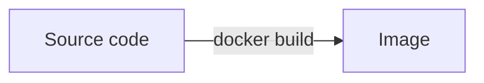

# Biblion

Turn plain markdown into a typeset PDF book — with real rendered diagrams —
locally, and for free on every run.

## Why

Asking an AI to produce a beautiful PDF is expensive. It burns thousands of
tokens on layout, spacing, colours and page structure, and you pay that cost
again every time you want a change.

Asking an AI for a markdown file is cheap. But run that markdown through a
generic online converter and you get something that looks like a printed
email: no cover, no contents page, no callouts, and diagrams left as raw
`mermaid` source in a grey box.

Biblion takes the cheap half and makes it look like the expensive half:

```
AI writes content-only markdown  →  biblion build  →  typeset PDF
   (paid once, in tokens)           (free, local, repeatable)
```

The AI spends tokens on *information*. Biblion owns *presentation* — cover
page, contents with real page numbers, callout boxes, syntax highlighting,
page-break rules, and diagram rendering. Change the theme and rebuild; you
never pay tokens again.

## Install

```bash
pip install -e .
```

Then check what your machine can render:

```bash
biblion doctor
```

You need:

| Tool | For | Install |
|---|---|---|
| **weasyprint** | the PDF itself | `pip install weasyprint` — see the platform note below |
| **mermaid-cli** | ` ```mermaid ` blocks | `npm install -g @mermaid-js/mermaid-cli` |
| a Chromium browser | rasterising both kinds of diagram | you almost certainly already have Chrome or Edge |
| **d2** *(optional)* | ` ```d2 ` blocks | [d2lang.com](https://d2lang.com/tour/install), or drop `d2`/`d2.exe` in the project folder |

**WeasyPrint's system libraries.** The pip package is not enough on its own;
it needs Pango at runtime.

- **Linux:** `sudo apt install libpango-1.0-0 libpangoft2-1.0-0 libffi-dev`
- **macOS:** `brew install pango libffi`, then add
  `export DYLD_FALLBACK_LIBRARY_PATH="$(brew --prefix)/lib"` to your shell
  profile. Homebrew installs the libraries under its own prefix, which
  Python's loader does not search, so without this WeasyPrint imports fine and
  then fails with `cannot load library 'libgobject-2.0-0'`.
- **Windows:** install the GTK3 runtime.

`biblion doctor` detects this and prints the fix for your platform.

Biblion finds a browser you already have (Edge on Windows, Chrome elsewhere)
and uses it for both renderers: it points mermaid-cli at it, and it
screenshots d2's SVG output with it. So neither puppeteer nor d2 ever
downloads its own ~150MB Chromium. Set `BIBLION_BROWSER` to override.

`rsvg-convert` is no longer required for d2 and is only used as a fallback
when no browser exists.

## Use

```bash
biblion init my-book      # scaffold book.toml + modules/
biblion prompt            # print the markdown contract to give your AI
biblion build             # render the PDF
biblion doctor            # check which renderers are available
biblion skill --install   # teach Claude Code to use Biblion
```

`biblion build` reads `book.toml` from the project folder, so a rebuild is one
word. Any setting can be overridden on the command line.

```toml
title    = "Introduction to Containers"
subtitle = "Course 8 of the IBM RAG and Agentic AI Certificate"
author   = "Compiled for Shivam"
eyebrow  = "IBM PROFESSIONAL CERTIFICATE · COURSE 8"

input  = "modules"
output = "output/Containers.pdf"

toc_depth = 3
strict    = false     # true = fail the build if any diagram fails to render
```

## Use with an AI agent

This is the whole point of the tool, so it ships as a first-class path.

```bash
biblion skill --install            # into ~/.claude/skills/biblion/
biblion skill --install --project . # or into this repo only
```

That installs a Claude Code skill telling the agent to write content-only
markdown and shell out to `biblion build`, instead of hand-building a PDF.
The agent spends its tokens on what to say; Biblion does the rest.

For any other assistant, `biblion prompt` prints the same contract as plain
text to paste into a chat.

## The markdown contract

`biblion prompt` prints a spec to paste into your AI before asking it to
write. The short version: write content, not styling. No HTML, no CSS, no
ASCII art, no hand-numbered table of contents.

Callouts use admonition syntax:

```
!!! deepdive "Why MCP exists"
    A language model is a brain in a jar. It needs hands.
```

Types: `deepdive`, `interview`, `workhelp`, `note`, `tip`.

Diagrams are the biggest saving. Thirty tokens of diagram source becomes a
real rendered figure:

````

````

## Figures

Give a diagram a caption and it becomes a numbered figure:

````
```d2 caption="How a request reaches a pod."
client -> ingress -> pod
```
````

Biblion numbers it per chapter ("Figure 2.3"), keeps the caption in the same
unbreakable block as the diagram so the two never split across a page, and
builds a **Figures** page with real page numbers. Uncaptioned diagrams are
left alone: not numbered, not listed. Turn the page off with
`--no-figure-list`.

## Diagram auto-fit

A ten-node `flowchart LR` is an 11:1 strip. Squeezed into a portrait text
column that is about 1.5cm tall, with 3pt labels — technically rendered,
practically unreadable.

Because direction is presentation and presentation is Biblion's job, wide
diagrams are re-rendered top-to-bottom and whichever version puts physically
larger text on the page wins. Anything still wide breaks out to the full page
width. Turn it off with `--no-autofit`.

## Notes

- `examples/diagram-tour/` is a worked example exercising both renderers;
  build it with `biblion build examples/diagram-tour`.
- Diagrams are cached on a hash of their source, so only changed diagrams
  re-render. The first build of a large book is slow; later ones are not.
- `--per-module` also writes one PDF per source file, titled from each file's
  own `#` heading.
- `--strict` exits non-zero if any diagram failed, which is what you want in
  CI. By default a failed diagram becomes a visibly-marked red box rather
  than silently looking like an ordinary code block.
- d2 is rasterised by screenshotting its SVG in headless Chrome/Edge, which
  handles d2's nested `<svg>` and base64 `@font-face` correctly. WeasyPrint
  and cairosvg both render that SVG wrong, so neither is used for it.
- `--allow-downloads` is only needed on a machine with no browser at all,
  where d2 has to fetch its own Chromium.

## Supported platforms

CI runs the unit tests on Linux, macOS and Windows, and builds
`examples/diagram-tour` end to end with `--strict` on Linux and macOS — so a
broken diagram renderer fails the build rather than shipping a book full of
red boxes.

The example book is not built on Windows in CI because WeasyPrint there needs
the GTK3 runtime, which has no clean unattended installer. Windows is the
platform Biblion is developed on, so it gets covered by hand.

## Layout

```
biblion/
  cli.py               build / doctor / init / prompt
  config.py            book.toml handling
  diagrams.py          mermaid + d2 rendering, caching, auto-fit
  document.py          markdown -> HTML, cover, contents
  tools.py             finding binaries and a browser
  themes/textbook.css  the stylesheet that does the actual work
  authoring_prompt.md  the contract `biblion prompt` prints
  skill/SKILL.md       the Claude Code skill `biblion skill` installs
```
