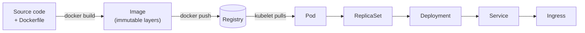
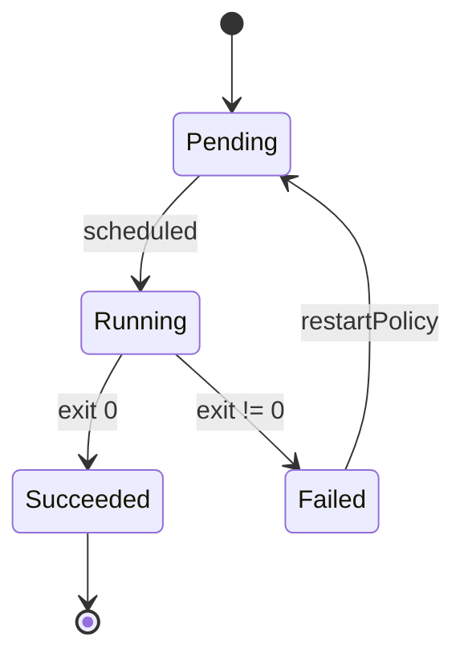

# Diagrams in Biblion

This example exists to prove the diagram pipeline end to end. Everything on
these pages was written as plain markdown — no HTML, no CSS, no image files.
The figures are rendered at build time from a few lines of source each.

## Why this matters for token cost

Asking an AI to *draw* a diagram means asking it to emit SVG paths or an ASCII
grid: hundreds of tokens, and the result is usually crooked. Asking it for
diagram *source* costs about thirty tokens and produces a real figure.

```d2
direction: right

ai: "AI writes markdown" {
  shape: rectangle
}

md: "modules/*.md\n(plain text)" {
  shape: page
}

biblion: "biblion build" {
  shape: hexagon
}

pdf: "Typeset PDF" {
  shape: document
}

ai -> md: "paid once, in tokens"
md -> biblion: "free, local"
biblion -> pdf: "repeatable"
```

!!! deepdive "The division of labour"
    The AI owns *information*. Biblion owns *presentation*: page size,
    margins, fonts, callout styling, contents pagination and diagram
    rendering. Change the theme and rebuild — you never pay tokens again.

## d2: architecture and containment

d2's strength is nesting. Things that live inside other things are drawn
inside other things, which is tedious to express in mermaid.

```d2
cluster: "Kubernetes cluster" {
  style.stroke: "#2e6da4"

  ingress: Ingress

  deploy: "Deployment" {
    rs: "ReplicaSet"
    pod1: "Pod"
    pod2: "Pod"
    rs -> pod1
    rs -> pod2
  }

  svc: "Service\nstable IP / DNS"

  ingress -> svc
  svc -> deploy.pod1
  svc -> deploy.pod2
}

registry: "Registry" {
  shape: cylinder
}

user: "Client" {
  shape: person
}

user -> cluster.ingress: "HTTPS"
registry -> cluster.deploy: "image pull"
```

### Sequence of a request

d2 also does sequence diagrams, which read well for protocol walkthroughs.

```d2
shape: sequence_diagram

client: Client
gw: API Gateway
svc: Service
db: Database

client -> gw: "POST /orders"
gw -> svc: "forward + auth context"
svc -> db: "INSERT order"
db -> svc: "order id"
svc -> gw: "201 Created"
gw -> client: "201 Created"
```

## mermaid: flows and state

mermaid is the better fit for process flows and state machines.



!!! note "Written left-to-right, rendered top-to-bottom"
    That chain was authored as `flowchart LR`. Eight nodes side by side is an
    11:1 strip, which in a portrait column is about 1.5cm tall with unreadable
    labels. Biblion re-rendered it top-to-bottom because direction is
    presentation, and presentation is Biblion's job. Pass `--no-autofit` to
    render exactly as authored.

### A state machine



## Tables and code still work

| Renderer | Best at | Needs |
|---|---|---|
| mermaid | flows, sequences, state, ER | `mmdc` + any Chromium browser |
| d2 | architecture, nesting, containment | `d2` + any Chromium browser |

```python
from biblion.diagrams import DiagramRenderer

renderer = DiagramRenderer(cache_dir=Path("output/_diagram_cache"))
html = renderer.process(markdown_text)
print(renderer.report.summary())
```

!!! workhelp "Which one to reach for"
    Use **mermaid** when the point is a sequence of steps or states. Use
    **d2** when the point is what contains what. If you find yourself
    fighting mermaid's `subgraph`, switch to d2.
