# Introduction to Containers with Docker, Kubernetes & OpenShift — Complete Study Notes

> Course 8 of 12 · IBM (Coursera) · 5 modules
> Notes compiled from every video transcript, reading, cheat sheet, and glossary in the course.
>
> **How to read this:** each module has three layers —
> **① Deep dive** (what it actually is and why), **② Interview angle** (question → sharp answer),
> **③ When to use X vs Y** (the decision you'll actually face at work).

---

## Table of Contents

| # | Module | Core question it answers |
|---|--------|--------------------------|
| [0](#0-the-30-second-mental-model) | Mental model | How do all these pieces fit together? |
| [1](#module-1--containers-and-containerization) | Containers & Docker | How do I package an app so it runs anywhere? |
| [2](#module-2--kubernetes-basics) | Kubernetes Basics | How do I run 1,000 containers without going insane? |
| [3](#module-3--managing-applications-with-kubernetes) | Managing Apps | How do I scale, update and configure them safely? |
| [4](#module-4--the-kubernetes-ecosystem-openshift-istio) | OpenShift & Istio | What does an enterprise platform add on top? |
| [5](#module-5--final-project-guestbook-app) | Final Project | Can I do it end-to-end? |
| [A](#appendix-a--command-cheat-sheets) | Cheat sheets | Every command in one place |
| [B](#appendix-b--master-glossary) | Glossary | Every term in one place |
| [C](#appendix-c--rapid-fire-interview-bank) | Interview bank | 60 Q&A, rapid fire |

---

## 0. The 30-second mental model

Everything in this course is one idea repeated at three altitudes:

1. **Docker** solves *"it works on my machine"* → package the app **+ its dependencies** into an immutable image.
2. **Kubernetes** solves *"I now have 4,000 of those and no idea where they are"* → declare desired state, let controllers reconcile reality toward it.
3. **OpenShift / Istio** solve *"my company needs this to be governed, buildable, and observable"* → enterprise platform + service-to-service networking layer.

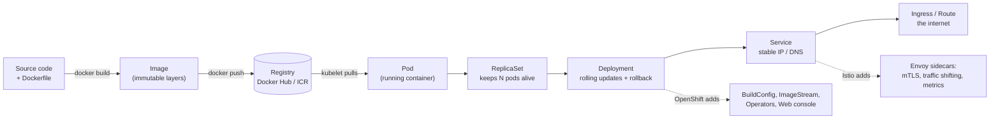

**The one sentence that unlocks Kubernetes:** *you never tell Kubernetes what to do — you tell it what you want to be true, and a control loop makes it true and keeps it true.* Every object has a `spec` (what you want, written by you) and a `status` (what is, written by Kubernetes); controllers close the gap forever.

---

# Module 1 — Containers and Containerization

## 1.1 Why containers exist at all

The course opens with a shipping-container analogy that is worth keeping, because it explains the *economics* rather than the technology. Shipping got cheap not when ships got better but when the **container size was standardised** — after that, the logistics layer (ship / plane / train / truck) became interchangeable. Software containers do the same thing: standardise the unit of software so the substrate (laptop / VM / bare metal / private cloud / public cloud) becomes interchangeable.

### The traditional-computing problems containers solve

| Traditional problem | What actually goes wrong | Container fix |
|---|---|---|
| **No isolation** | Apps on one physical server fight over CPU/RAM; one bad app takes down neighbours | Namespaces + cgroups isolate each app |
| **Poor utilisation** | Servers sit at 10% or get crushed at 100% → bad ROI | Many containers per host; bin-packing |
| **Expensive provisioning** | Comprehensive provisioning + costly maintenance | Pull an image, start in seconds |
| **Peak-load ceilings** | Physical server limits constrain performance | Scale out horizontally |
| **Not portable** | App tied to one OS / environment | Image runs anywhere the engine runs |
| **Resiliency is hard** | Hardware HA is time-consuming, complex, expensive | Restart/replace containers cheaply |
| **Limited scalability** | On-prem can't grow fast | Cloud + orchestration |
| **Automation is hard** | Distributing to many platforms manually | Image + declarative config = automatable |

### Definition to memorise

> A **container** is a standard unit of software, powered by a containerization engine, that encapsulates **application code, runtime, system tools, system libraries and settings** so programmers can efficiently **build, ship and run** applications.

### Characteristics

- **Lightweight** — often tens of megabytes; starts almost instantly
- **Isolated** — its own namespace for networking, storage, processes, hostname
- **Portable** — laptop → test → staging → prod → VM → private cloud → public cloud
- **OS-independent** — Windows, Linux, macOS
- **Language/IDE-independent** — Python, Node, Java, Go…
- **Platform-independent** — cloud, desktop, on-premises

### Benefits vs challenges (this exact pairing shows up in quizzes)

| Benefits | Challenges |
|---|---|
| Quickly create applications using automation | **Server security** — if the host OS is compromised, all containers on it are exposed (shared kernel) |
| Lower deployment time and costs | **Management at scale** — thousands of containers overwhelm humans → this is *why Module 2 exists* |
| Improve CPU/memory utilisation | **Legacy migration** — converting monolithic apps is complex |
| Port across environments | **Right-sizing** — picking correct CPU/memory per container is genuinely hard |
| Support next-gen apps (microservices) | |

### Container vendors named in the course

| Vendor | The one-line differentiator the course gives |
|---|---|
| **Docker** | Most popular, robust, the de-facto platform |
| **Podman** | **Daemon-less** container engine → *more secure than Docker* |
| **LXC** (LinuX Containers) | Preferred for **data-intensive** applications and operations |
| **Vagrant** | Highest level of **isolation** on the running physical machine |

---

## 1.2 Docker

> **Docker (2013):** an open platform for developing, shipping and running applications as containers.

Written in **Go**. Uses **Linux kernel features** — most importantly **namespaces**, which give each container an isolated workspace. Docker creates *a set of namespaces per container*, and each aspect (network, storage, processes, hostname…) runs in a separate namespace with access limited to that namespace.

**Why Docker won:** simple architecture, massive scalability, portability across platforms/environments/locations, and it isolates the application from the infrastructure (hardware, OS, container runtime).

**The ecosystem Docker inspired:** Docker CLI, Docker Compose, Prometheus; storage plugins; orchestration via Docker Swarm or Kubernetes; methodologies like microservices and serverless.

**Benefits (exam-phrasing):** consistent + isolated environments → stable deployments; deployments in seconds; small reusable images speed development; automation eliminates errors; supports **Agile and CI/CD DevOps** practices; easy versioning speeds testing/rollbacks/redeployments; segments apps for easy refresh/cleanup/repair; platform-independent → highly portable.

**Where Docker containers are a bad fit** (stated explicitly in the Module 1 summary): **monolithic applications**, and workloads with **strict high-performance or high-security requirements**.

---

## 1.3 Docker objects

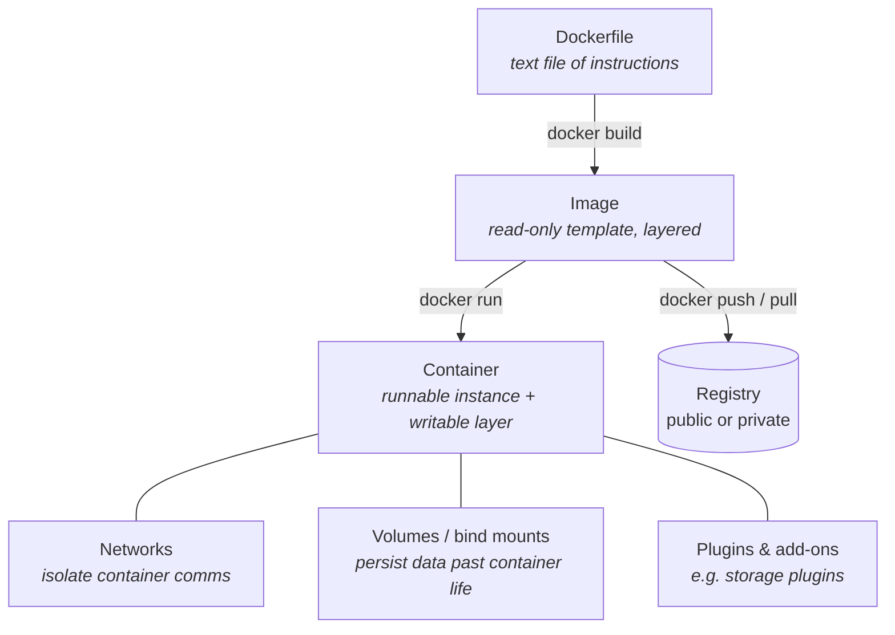

### Dockerfile — the essential instructions

| Instruction | What it does | Gotcha worth knowing |
|---|---|---|
| `FROM` | Defines the **base image**. A Dockerfile **must always begin with FROM** | Often a public OS or language image (ubuntu, node, openjdk) |
| `RUN` | Executes commands **at build time** (creates a new layer) | Each `RUN` = a new layer; chain with `&&` to keep images small |
| `CMD` | Defines the **default command executed when the container starts** | **Only one CMD takes effect** — if several exist, *the last one wins* |
| `WORKDIR` | Sets the working directory inside the image | |
| `COPY` | Copies build-context files into the image | |
| `EXPOSE` | Documents/allows the port the app listens on | `EXPOSE` alone doesn't publish it — you still need `docker run -p` |
| `LABEL` | Adds metadata (maintainer, version, description) | |
| `HEALTHCHECK` | Command Docker runs to decide if the container is healthy | Marks container `unhealthy` on failure; find them with `docker ps --filter "health=unhealthy"` |

**The course's reference Dockerfile (Java example):**

```dockerfile
# Use an official OpenJDK 21 image as the base image
FROM openjdk:21-jdk-slim

# Set a working directory inside the container
WORKDIR /app

# Label the image with metadata
LABEL maintainer="Your Name <your.email@example.com>"
LABEL version="1.0"
LABEL description="A Java web application running in Docker"

# Copy the compiled JAR file to the container
COPY target/myapp.jar /app/myapp.jar

# Expose port 8080 to allow external access
EXPOSE 8080

# Run the application when the container starts
CMD ["java", "-jar", "/app/myapp.jar"]

# Health check to ensure the application is running
HEALTHCHECK --interval=30s --timeout=10s --start-period=10s --retries=3 \
  CMD curl --fail http://localhost:8080/health || exit 1
```

```bash
docker build -t my-java-app .            # build
docker run -p 8080:8080 my-java-app      # run, publishing the port
docker ps --filter "health=unhealthy"    # check health
```

### Images and layers — the bit interviewers probe

- An image is a **read-only template**. **Each Dockerfile instruction creates a new layer.**
- Change the Dockerfile and rebuild → **Docker rebuilds only the changed layers** (and everything after it).
- **Images share layers** → saves disk space *and* network bandwidth on push/pull.
- Instantiate an image → a **thin writable container layer** is added on top. That's the whole difference: **images are immutable, containers are not.**

> **Immutability:** images are read-only; "changing" an image actually produces a *new* image.

### Image naming — three parts

```
docker.io / ubuntu : 18.04
└─hostname─┘ └repo┘ └tag┘
```

| Part | Meaning |
|---|---|
| **Hostname** | The image **registry** (`docker.io` = Docker Hub). Can be omitted in the Docker CLI — it defaults to Docker Hub |
| **Repository** | A group of related container images (`ubuntu`) |
| **Tag** | A specific version or variant (`18.04`, `v1`, `latest`) |

### Containers, networks, storage, plugins

- A **container is a runnable instance of an image**; create/start/stop/delete via the Docker API or CLI.
- You can connect it to multiple **networks**, attach **storage**, or commit a **new image from its current state**.
- **By default data does not persist** when the container is gone → use **volumes** and **bind mounts**.
- **Plugins** (e.g. storage plugins) connect Docker to external storage platforms.

---

## 1.4 Docker architecture

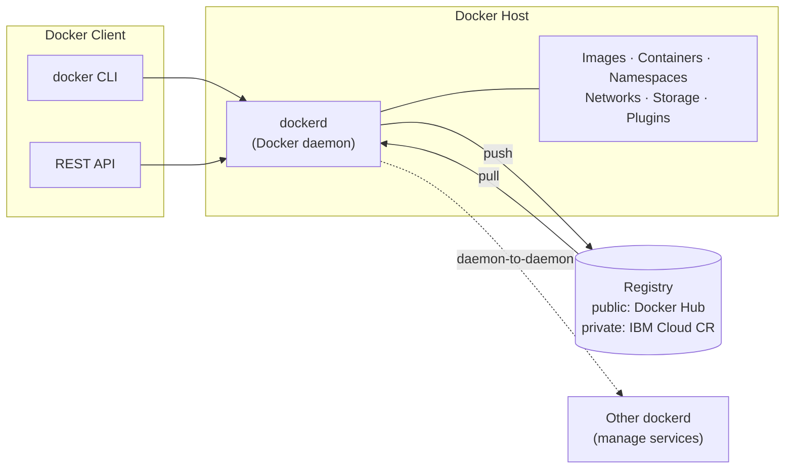

**Three components: client, host, registry.**

- **Client** — CLI or REST API; sends instructions. Can talk to **local and remote** Docker hosts, and to **more than one daemon**.
- **Host** — contains **`dockerd`**, the daemon. It listens for Docker API requests/commands (e.g. `docker run`) and does the **heavy lifting: build, run, distribute** containers. It also manages images, containers, namespaces, networks, storage, plugins and add-ons.
- **Registry** — where images are **stored and distributed**. **Public** (Docker Hub, open to everyone) or **private** (enterprises usually choose private for security). Hosted by a third party (e.g. **IBM Cloud Container Registry**) or self-hosted on-prem/cloud.

### The containerization lifecycle (`build` → `push` → `run`)

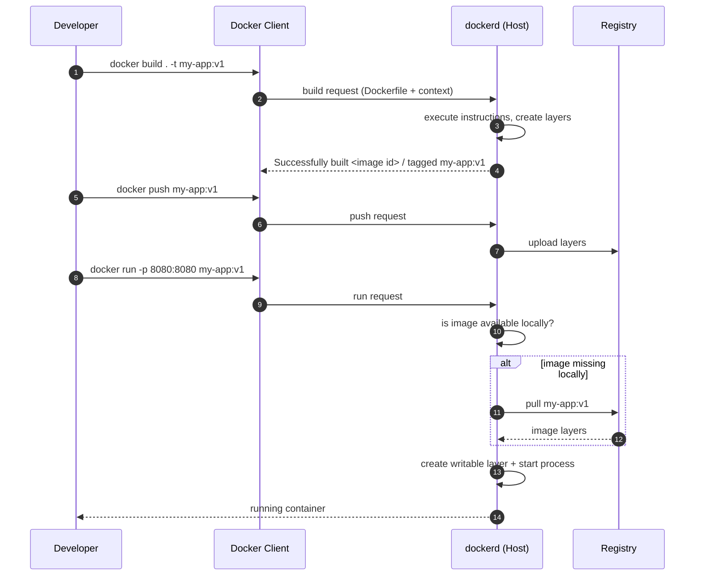

**Say this in an interview:** *build* turns a Dockerfile into an image; *push* stores it in a registry; *run* creates a container from the image — and if the image isn't on the host, the daemon pulls it first. `docker images` verifies the build; `docker ps -a` verifies the run.

---

## 1.5 ⭐ Module 1 — Interview angle

**Q: What's the difference between a container and a virtual machine?**
A VM virtualises **hardware** — each VM ships a full guest OS, so it's gigabytes and boots in minutes. A container virtualises the **operating system** — the container engine shares the host kernel, so a container is tens of megabytes and starts almost instantly. The trade-off: VMs give stronger isolation (separate kernels); containers give density and speed but share a kernel, which is exactly why the course lists *"server security becomes an issue if the host OS is affected"* as a container challenge.

**Q: What's the difference between an image and a container?**
An image is an **immutable, read-only, layered template**. A container is a **runnable instance** of that image with a **thin writable layer** on top. One image → many containers. Change an image and you don't mutate it, you build a new one.

**Q: Why does Docker use layers?**
Build speed and storage/bandwidth economy. Each instruction is a layer; a rebuild only redoes changed layers and everything downstream. Different images sharing the same base share those layers on disk and skip re-downloading them on pull.

**Q: What is `dockerd` and what does it do?**
The Docker daemon on the Docker host. It listens for Docker API requests, and builds, runs and distributes containers. It also manages images, containers, namespaces, networks, storage and plugins. The client (CLI/REST) is just the thing that talks to it — and it can talk to remote daemons too.

**Q: How does Docker achieve isolation?**
Linux **namespaces** (plus cgroups for resources). Docker creates a set of namespaces per container — network, storage, processes, hostname — and each aspect runs in its own namespace with access limited to it.

**Q: `CMD` appears three times in a Dockerfile. What happens?**
Only the **last** one takes effect. A Dockerfile should have exactly one `CMD`.

**Q: `EXPOSE 8080` is in my Dockerfile but I can't reach the app. Why?**
`EXPOSE` is documentation/intent — it doesn't publish the port to the host. You need `docker run -p 8080:8080`.

**Q: When would you *not* containerise?**
Monolithic legacy applications (migration cost is high and you get little of the benefit), and workloads with strict high-performance or high-security requirements where the shared kernel or added abstraction is unacceptable. Also anything genuinely stateful-and-simple where the operational overhead outweighs the win.

**Q: Public vs private registry?**
Public (Docker Hub) is open to everyone — great for base images and OSS. Private (IBM Cloud Container Registry, self-hosted) restricts access to authorised users — what enterprises use for their own images, for security and control.

---

## 1.6 ⭐ Module 1 — When to use X vs Y

| Decision | Choose the first when… | Choose the second when… |
|---|---|---|
| **Container vs VM** | You need density, fast start, portability, microservices, CI/CD | You need hard multi-tenant isolation, a different kernel/OS, or you're running untrusted third-party code |
| **Docker vs Podman** | Team familiarity, biggest ecosystem, tooling everywhere | You want **daemon-less** and rootless operation — the course's stated security edge |
| **Docker vs LXC** | Application-centric packaging and shipping | **Data-intensive** workloads and OS-level "lightweight VM" semantics |
| **Docker vs Vagrant** | Ship the app | You need the **highest isolation** on the physical machine (Vagrant orchestrates full VMs) |
| **Volume vs bind mount** | Docker-managed, portable, works with storage plugins/external platforms | You specifically need a host directory mapped in (local dev, host config files) |
| **`latest` vs pinned tag** | Never in production | **Always** in production — see the anti-patterns in Module 2; `latest` causes unexplained pod crashes and untraceable rollbacks |
| **Public vs private registry** | Base images, open-source distribution | Anything proprietary, regulated, or with credentials baked near it |

---

# Module 2 — Kubernetes Basics

## 2.1 Container orchestration — the problem statement

> *"Everyone's container journey starts with one container. However, things don't stay this way for long."*

One container → several → hundreds → thousands across regions. At that point connecting, managing and scaling them by hand is impossible.

> **Container orchestration** is a process that **automates the container lifecycle** of a containerized application: **deployment, management, scaling, networking, and availability.**

### What orchestration tools actually do

- Define **which images** make up the application and **where they live** (which registry)
- Improve **provisioning and deployment** — automated, unified, smooth
- **Secure network connections** between containers
- Ensure availability/performance by **relocating containers** to another host on outage or resource shortage
- **Scale** containers to meet demand and **load balance** requests
- Handle **resource allocation and scheduling** onto the underlying infrastructure
- Perform **rolling updates and rollbacks**
- Run **health checks** and take action when they fail

Configuration is written in **YAML or JSON**. Those files configure each container so it can find resources, establish a network and store logs; orchestration then schedules the container onto the right host based on predefined settings/restrictions and manages the lifecycle against system parameters (CPU, memory) and file parameters (proximity, metadata).

Orchestration runs **on-premises, public, private or multi-cloud**, and is often part of an organisation's **SOAR** (Security Orchestration, Automation and Response) requirements.

### The four orchestrators the course names

| Tool | Origin / niche |
|---|---|
| **Marathon** | A framework for **Apache Mesos** (open-source cluster manager from UC Berkeley); automates the bulk of management/monitoring to scale container infrastructure |
| **Nomad** (HashiCorp) | Free and open-source cluster manager + scheduler; supports Docker **and** standalone/virtualized/containerized apps on all major OSes, on-prem or cloud — maximum workload flexibility |
| **Docker Swarm** | Purpose-built for Docker Engine and Docker tooling → natural choice for teams already all-in on Docker |
| **Kubernetes** | Google-developed, CNCF-maintained, **the de-facto standard**; deployment, storage provisioning, load balancing, scaling, service discovery, self-healing |

### Benefits (the six the course lists)

Increased productivity · faster deployments · reduced costs (containers have lower overhead than VMs/traditional servers) · stronger security (shared resources + isolated processes) · easier scalability (scale with a single command) · faster error recovery (detect and resolve infrastructure failures automatically).

---

## 2.2 What Kubernetes is — and is *not*

> **Kubernetes:** an open-source system for automating **deployment, scaling and management** of containerized applications. Developed at Google, maintained by the **CNCF**, portable across clouds and on-premises.

The key behaviour is **declarative management**: you express the desired state, Kubernetes *automatically performs the operations needed to reach it* — and keeps performing them.

### What Kubernetes is NOT (a favourite interview question)

| It is not… | Because… |
|---|---|
| A traditional all-inclusive **PaaS** | It's a flexible model, not an opinionated app platform |
| **Rigid or opinionated** | Supports stateless, stateful and data-processing workloads — anything containerizable |
| A **CI/CD pipeline** | It does **not** build applications or deploy source code — bring Jenkins/Tekton/GitLab |
| A **logging/monitoring/alerting** solution | It doesn't prescribe one; integrate third-party/open-source tools |
| A provider of **middleware, databases or other services** | No built-in middleware or DBs |

### Kubernetes concepts (the checklist from the video)

**Pods** (smallest deployable compute object) · **Services** (expose apps running on sets of Pods; each Pod gets a unique IP, sets of Pods get one DNS name) · **Storage** (persistent and temporary) · **Configuration** (provisioning resources to configure Pods) · **Security** (enforced for Pod and API access) · **Policies** (match Pods to Nodes so the kubelet can find and run them) · **Scheduling and eviction** (run Pods; proactively terminate them on resource-starved Nodes) · **Preemption** (terminate lower-priority Pods so higher-priority ones can schedule) · **Cluster administration**.

### Kubernetes capabilities (memorise this list — quizzes love it)

1. **Automated rollouts and rollbacks** of app/config changes, with health monitoring
2. **Storage orchestration** — auto-mount local, network, or public-cloud storage
3. **Horizontal scaling** — by metrics or by command
4. **Automated bin packing** — auto-placement by resource requirements + constraints, mixing critical and best-effort workloads to raise utilisation without sacrificing HA
5. **Secret and configuration management** — passwords, OAuth tokens, SSH keys; update them **without rebuilding images**
6. **IPv4/IPv6 dual-stack** — both address families for Pods and Services
7. **Batch execution** — batch and CI workloads; replaces failed containers
8. **Self-healing** — restart, replace, reschedule, kill failing/unresponsive containers
9. **Service discovery and load balancing** — by IP or single DNS name
10. **Designed for extensibility** — add features **without modifying source code**

### The ecosystem
Kubernetes alone isn't enough: you also need image building, a **container registry**, logging/monitoring, and CI/CD. The course lists providers across public cloud (IBM, Google, AWS), open-source frameworks (Red Hat, VMware, SUSE, Docker, Cloud Foundry), management, tooling (JFrog, Bitnami), monitoring/logging (Datadog, Grafana, New Relic, Sysdig, Dynatrace), security (Aqua, Cilium, Twistlock) and load balancing (NGINX, VMware).

---

## 2.3 Kubernetes architecture

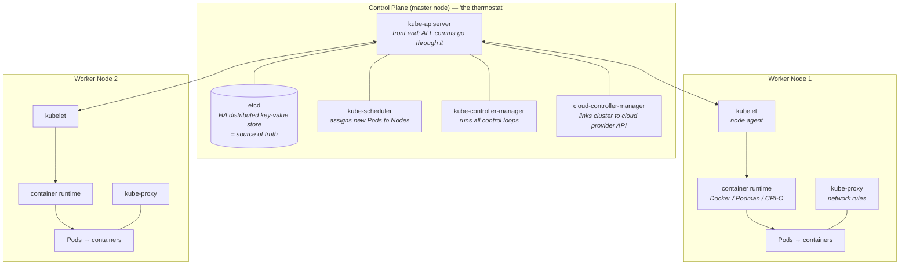

### Control plane components

| Component | Job | Detail worth quoting |
|---|---|---|
| **kube-apiserver** | Exposes the Kubernetes API; the **front end** of the control plane | **All communication in the cluster uses this API.** Designed to **scale horizontally** — run several instances and load-balance across them |
| **etcd** | Highly available **distributed key-value store** holding **all cluster data** | It **defines the state** of the cluster; the system works to bring actual state in line with what's in etcd |
| **kube-scheduler** | Assigns **newly created Pods** to Nodes | Picks the most optimal node per scheduling principles, config options and available resources |
| **kube-controller-manager** | Runs **all controller processes** | Each controller is a **control loop** watching state and driving actual → desired |
| **cloud-controller-manager** | Runs controllers that talk to the **cloud provider's API** | Exists so Kubernetes and cloud providers can **evolve independently** — keeps Kubernetes cloud-agnostic |

**The thermostat analogy (use it in interviews):** you set the desired temperature; the thermostat continuously regulates heating and cooling to reach and hold it. The control plane does exactly that for cluster state.

### Worker (data) plane components

| Component | Job |
|---|---|
| **Node** | The worker machine — virtual or physical. **Nodes are not created by Kubernetes**; the cloud provider creates them, and the control plane manages them. That's what lets Kubernetes run on any infrastructure |
| **Pod** | Smallest deployment entity; one or more containers that **share all the node resources allocated to them** and can communicate among themselves |
| **kubelet** | **The most important component of a worker node.** Talks to kube-apiserver to receive new/modified Pod specs, ensures those Pods and containers are running as desired, and **reports Pod health and status back** to the control plane |
| **Container runtime** | Downloads images and runs containers. Kubernetes implements a **Container Runtime Interface (CRI)** so the runtime is **pluggable** — Docker, Podman, CRI-O |
| **kube-proxy** | Network proxy on each node; maintains the network rules that allow communication to Pods (i.e. to your workloads) |

---

## 2.4 Kubernetes objects

> A **Kubernetes object** is a **persistent entity** — it exists until modified or removed, surviving failures.

Every object has two main fields:

| Field | Written by | Meaning |
|---|---|---|
| **`spec`** | **You** | The **desired state** |
| **`status`** | **Kubernetes** | The **current state** |

Kubernetes continuously works to make `status` match `spec`. You interact with objects via the **Kubernetes API** (client libraries) and/or **kubectl**.

**Labels** are key-value pairs attached to objects for identification. Critically: **a label does not uniquely identify a single object** — many objects can share labels, and that's the point. **Label selectors are the core grouping mechanism in Kubernetes** — they're how a ReplicaSet finds "its" Pods and how a Service finds its backends.

**Namespaces** isolate groups of resources within a *single* cluster. Useful when teams share a cluster for cost reasons or run multiple projects in isolation; ideal when the number of cluster users is large. Examples: `kube-system` (system users) and `default` (user applications). A namespace provides a **scope for names** — each object must have a unique name **for that resource type within that namespace**.

### The workload object ladder

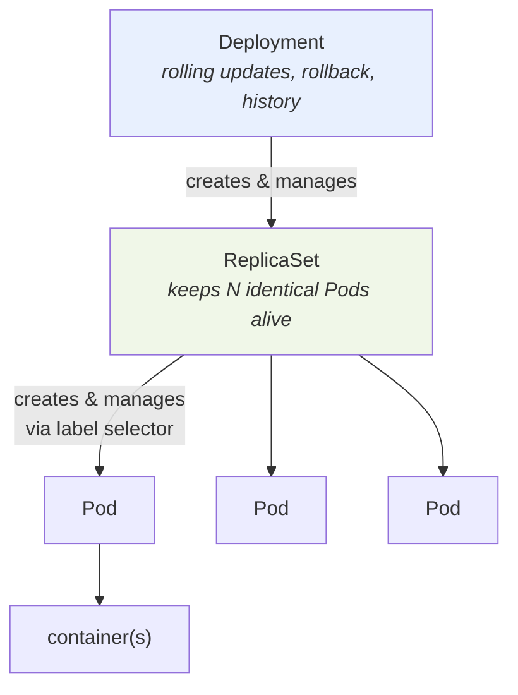

> **Key subtlety:** *Kubernetes keeps object types independent — the ReplicaSet does not own its Pods.* It uses **Pod labels** to decide which Pods to acquire. That's why the `selector.matchLabels` must match the pod template's `labels`.

#### Pod

The simplest unit: a process, or a single instance of an application running in the cluster. Usually wraps one container (sometimes several tightly-coupled ones). Creating **replicas of a Pod is how you scale horizontally**. A Pod spec must contain **at least one container**.

```yaml
apiVersion: v1
kind: Pod
metadata:
  name: nginx
spec:
  containers:
    - name: nginx
      image: nginx:1.25
      ports:
        - containerPort: 80
```

#### ReplicaSet

A set of identical, horizontally-scaled Pod replicas.

```yaml
apiVersion: apps/v1
kind: ReplicaSet
metadata:
  name: nginx-rs
spec:
  replicas: 3                 # desired count — change it and RS adds/deletes Pods
  selector:
    matchLabels:
      app: nginx              # MUST match template.metadata.labels
  template:                   # the Pod template
    metadata:
      labels:
        app: nginx
    spec:
      containers:
        - name: nginx
          image: nginx:1.25
```

> **Course guidance, stated twice:** *creating ReplicaSets directly is not recommended.* Create a **Deployment**, which manages ReplicaSets and gives you more features and better control. A ReplicaSet also **supersedes the older ReplicationController** — use ReplicaSet, never ReplicationController.

#### Deployment

Higher-level object providing **declarative updates for Pods and ReplicaSets**. Runs multiple replicas via ReplicaSets and adds management capabilities on top. **Suitable for stateless applications** — for stateful ones use **StatefulSet**.

```yaml
apiVersion: apps/v1
kind: Deployment
metadata:
  name: hello-kubernetes
spec:
  replicas: 3
  selector:
    matchLabels:
      app: hello
  template:
    metadata:
      labels:
        app: hello
    spec:
      containers:
        - name: hello
          image: myrepo/hello:v1
          ports:
            - containerPort: 8080
```

> **The one feature Deployments have that ReplicaSets don't: rolling updates.** A rolling update scales up a new version to the appropriate number of replicas and scales the old version down to zero. *The ReplicaSet ensures the right number of Pods exist; the Deployment orchestrates the rollout of a new version.*

---

## 2.5 Services and the networking objects

> A **Service** is a **REST object** (like a Pod). It is a **logical abstraction for a set of Pods**, providing access policies and acting as a **load balancer across those Pods**. Each Service gets a **unique IP address**, and it **eliminates the need for a separate service-discovery process**.

**Why Services exist:** Pods are ephemeral — they get destroyed and recreated at any time, so their **IP addresses change**. A Service **tracks Pod changes** and exposes **one stable IP / DNS name**, using **selectors** to target the set of Pods. For native Kubernetes apps, API **endpoints are updated whenever Pods in the Service change**; for non-native apps, Kubernetes puts a **virtual-IP-based bridge or load balancer** between the app and the backend Pods.

Services support **multiple protocols** (TCP is the default, plus UDP and others), **multiple port definitions**, an **optional selector**, and can map an incoming port to a **target port** (and the port with the same *name* can differ per backend Pod).

### The four Service types

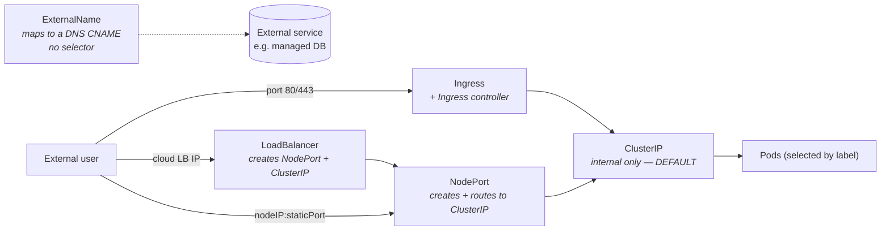

| Type | Reachable from | Creates | Use it for |
|---|---|---|---|
| **ClusterIP** | **Inside the cluster only** — this is the **default and most common** | — | **Inter-service communication**, e.g. frontend → backend. Cannot be reached from outside |
| **NodePort** | `\<any node IP\>:\<static port\>` | An **extension of ClusterIP** — automatically creates and routes to a ClusterIP Service | Dev/test, or a single service with no load-balancing needs. **Not recommended for production** (security) |
| **LoadBalancer** (external LB / ELB) | A public IP from the cloud provider | An **extension of NodePort** — automatically creates **both** NodePort and ClusterIP Services | Exposing a service to the internet. Needs a **new ELB with an IP address** per service → gets expensive |
| **ExternalName** | N/A — it's a DNS alias | Nothing; requires `spec.externalName`, **maps to a DNS name and not to any selector**, returns a **CNAME** record | Representing **external storage/services**, and letting **Pods in different namespaces talk to each other** |

> **Nesting is the exam trick:** LoadBalancer ⊃ NodePort ⊃ ClusterIP. Creating a LoadBalancer silently creates the other two.

### Ingress — object vs controller

> **Ingress** is an API object that, **combined with a controller**, provides **routing rules** to manage external users' access to **multiple services** in a cluster. In production it exposes apps to the internet via **port 80 (HTTP)** or **port 443 (HTTPS)**. *The cluster monitors Ingress, but the external load balancer is expensive and is managed outside the cluster.*

| Feature | **Ingress object** | **Ingress controller** |
|---|---|---|
| Definition | API object managing external access to services | Cluster resource that **implements** the rules the object specifies |
| Primary function | Regulates external access routing | Fulfils the Ingress — executes the directives |
| Configuration source | Rules defined on the Ingress resource | Reads and processes info from the Ingress object |
| Traffic handling | Manages **HTTP and HTTPS** routes | Uses a load balancer / configures frontends |
| Activation | Active once configured | **Must be explicitly running** — unlike controllers baked into `kube-controller-manager` |
| Analogy | The **traffic rule set** | The **executor** — e.g. an NGINX instance applying the rules |

Ingress can give services externally-accessible URLs, balance traffic, terminate **SSL/TLS**, and enable **name-based virtual hosting**. It does **not** handle arbitrary ports or protocols — for non-HTTP(S) traffic use `Service.Type=NodePort` or `Service.Type=LoadBalancer`.

### The other workload objects

| Object | What it guarantees | Classic use |
|---|---|---|
| **DaemonSet** | **A copy of a Pod on (a set of) nodes.** As nodes join the cluster, Pods are added to them; Pods are garbage-collected when nodes are removed; deleting the DaemonSet removes all its Pods | **Storage, logs, and monitoring** agents — anything that must exist on *every* node |
| **StatefulSet** | Manages **stateful applications**: deployment + scaling of Pods with **guarantees about ordering and uniqueness**, a **sticky identity** per Pod, and **persistent storage volumes** | Databases, queues, anything where Pod identity and disk must survive rescheduling |
| **Job** | Creates Pods and **tracks completion**. **Retried until completed.** Deleting a Job removes its Pods; suspending it deletes active Pods until resumed. Can run **several Pods in parallel** | Batch work, migrations, one-off tasks. **CronJobs** create Jobs on a repeating schedule |

---

## 2.6 kubectl and the three management approaches

> **kubectl** ("kube command tool line") is the Kubernetes CLI: deploy applications, inspect and manage cluster resources, view logs.

**Command structure — order is critical:**

```
kubectl  <command>  <TYPE>  <NAME>  <flags>
         │          │       │       └── options that override defaults
         │          │       └── resource name (if applicable)
         │          └── pod | deployment | replicaset | service …
         └── create | get | apply | delete | scale | autoscale | rollout …
```

### The three command types

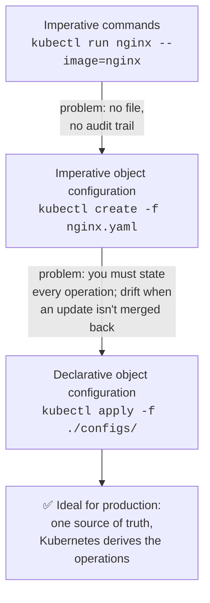

| Approach | How it works | Pros | Cons |
|---|---|---|---|
| **Imperative commands** | Create/update/delete **live objects directly**; operations passed as args/flags | **Easiest to learn and run** | **No audit trail**; **not flexible** (limited options); no templates; can't integrate with change review. *Fine for dev/test only* |
| **Imperative object configuration** | `kubectl create -f nginx.yaml` — command specifies the operation, file holds the **full object definition** (YAML/JSON) | Templates → **identical results across environments**; storable in **Git**; integrates with change processes; **audit trail** | Requires knowing the object **schema** and writing YAML/JSON; **you must specify every operation**, so an unmerged update silently strands the next developer on an old config |
| **Declarative object configuration** | `kubectl apply -f <dir-or-file>` — you store the **desired state**, **kubectl figures out the operations** | **Automated**, no user-specified operations, works on **directories or individual files**, single source of truth, self-correcting | Requires discipline: the files must be the truth |

> **The narrative the course tells:** Dev A deploys imperatively; Dev B can't reproduce it because there's no config file and has to ask what command was run. Fix: use a template. But with *imperative* object configuration, if Dev A updates a live object without merging it back, Dev B deploys the stale version. Fix: **declarative** — everyone applies the shared template and Kubernetes reconciles. **Declarative object configuration is the ideal method for production systems.**

### Everyday kubectl

```bash
# Inspect
kubectl get pods                          # pods in current namespace
kubectl get pods -o wide                  # with node/IP detail
kubectl get pods --all-namespaces
kubectl get services                      # services in current namespace
kubectl get deployments
kubectl get deployment my-dep             # one specific deployment
kubectl describe pod my-pod               # deep detail + events
kubectl config get-clusters               # clusters in kubeconfig
kubectl config get-contexts               # current context

# Create — imperative
kubectl run nginx --image=nginx           # a pod with a container
kubectl create deployment my-dep --image=nginx --replicas=3
kubectl expose deployment my-dep --port=8080 --type=NodePort

# Create/update — declarative (production)
kubectl apply -f deployment.yaml
kubectl apply -f ./k8s/                   # every file in the directory
kubectl apply -f https://example.com/app.yaml

# Scale
kubectl scale --replicas=3 rs/foo
kubectl scale --replicas=3 -f resourceinfo.yaml
kubectl scale deployment my-dep --replicas=5

# Cleanup / plumbing
kubectl delete pod my-pod
kubectl proxy                             # proxy between localhost and the API server
kubectl version                           # client + server versions
```

---

## 2.7 Kubernetes anti-patterns (from the reading — genuinely good interview material)

| # | Anti-pattern | Why it hurts | Do this instead |
|---|---|---|---|
| 1 | **Baking configuration into images** | Env-specific artifacts (hardcoded IPs, passwords, env prefixes) force rebuilds and put *untested* images into prod | Build **generic images** independent of runtime settings; inject config at runtime |
| 2 | **One pipeline for infra + application** | App code changes far more often than infra → wasted time and resources | **Split** infrastructure and application pipelines |
| 3 | **Requiring a specific startup order** | K8s starts components **simultaneously**; network latency then causes crashes or temporary unavailability | **Anticipate failure** — retries, backoff, health probes; design for simultaneous init |
| 4 | **No CPU/memory limits** | Default is unlimited → one app can monopolise the whole cluster | Set **requests and limits** on every workload after profiling behaviour |
| 5 | **Using the `latest` tag in production** | Sporadic image pulls, unexplained pod crashes, no versioning → undebuggable outages | **Specific, meaningful tags** (include build date/time); keep images **immutable**; store data externally |
| 6 | **One cluster for prod and non-prod** | Default permissions + non-namespaced resources create security and blast-radius problems | **At least two clusters** — one production, one non-production |
| 7 | **Ad-hoc `kubectl edit` / `kubectl patch`** | **Configuration drift** between environments → failed deployments | All deployments **through Git commits** → history, exact knowledge of cluster contents, easy rollback |
| 8 | **No health checks** | Failures go undetected; *overly complex* probes with unpredictable timing cause an internal DoS | **Liveness and readiness probes** on every container, kept simple and fast |
| 9 | **Secrets embedded in containers**, or many different secret mechanisms | Insecure; complicates local dev and testing | **One consistent strategy** (e.g. HashiCorp Vault); pass secrets at **runtime** |
| 10 | **Bare Pods / multiple processes per container** | Pods alone lack durability, rescheduling and data guarantees | Use **Deployment / Job / StatefulSet** with a replication factor; **one process per container**, multiple containers per Pod if needed |

---

## 2.8 ⭐ Module 2 — Interview angle

**Q: Explain the Kubernetes control loop in one breath.**
Every object has a `spec` (desired, written by me) and a `status` (actual, written by Kubernetes). Controllers are non-terminating loops that watch the cluster and take action to move actual toward desired. etcd holds the truth; the API server is the only door; the scheduler places new Pods; the kubelet on each node makes the local reality match, and reports back.

**Q: Pod, ReplicaSet, Deployment — why three objects?**
Separation of concerns. A Pod is one running instance. A ReplicaSet's only job is "keep exactly N Pods matching this label selector alive." A Deployment's job is versioning: it creates a *new* ReplicaSet for the new version and orchestrates shifting replicas from old to new, which is what gives you rolling updates, rollout history and rollback. You almost never create the bottom two directly.

**Q: Does a ReplicaSet own its Pods?**
No — and this is deliberate. Kubernetes keeps object types independent. The ReplicaSet **acquires Pods by label selector**. That's why `spec.selector.matchLabels` must match `spec.template.metadata.labels`, and why a stray Pod with the same labels will get adopted (and possibly deleted to satisfy the replica count).

**Q: What actually happens when I `kubectl apply` a Deployment?**
kubectl sends it to the **API server**, which validates it and persists it in **etcd**. The **Deployment controller** sees a Deployment with no ReplicaSet and creates one. The **ReplicaSet controller** sees a ReplicaSet with 0 of N Pods and creates Pod objects. The **scheduler** sees unscheduled Pods and binds each to a Node. The **kubelet** on that Node sees a Pod assigned to it, calls the **container runtime** to pull the image and start containers, and reports status back through the API server. **kube-proxy** programs the network rules so the Service can reach them.

**Q: Why not just talk to Pod IPs?**
Pods are ephemeral; their IPs change on every reschedule. A Service gives you one stable IP and DNS name, tracks the backing Pods by selector, and load-balances across them — that's built-in service discovery, so you don't run a separate discovery system.

**Q: ClusterIP vs NodePort vs LoadBalancer vs Ingress — when do I use which?**
ClusterIP for anything internal (frontend→backend). NodePort for quick dev/test access — not production. LoadBalancer when a single service needs its own public IP from the cloud provider; the downside is one expensive LB per service. Ingress when several HTTP/HTTPS services should share **one** entry point with host/path routing and TLS termination — but remember Ingress is inert without an Ingress **controller** running.

**Q: What's the difference between an Ingress and an Ingress controller?**
The Ingress object is the *rules*; the Ingress controller is the *thing that enforces them* (an NGINX/HAProxy/cloud LB deployment). Unlike controllers bundled into `kube-controller-manager`, the Ingress controller must be explicitly installed and running, otherwise your Ingress resource does nothing.

**Q: Deployment vs StatefulSet vs DaemonSet vs Job?**
Deployment = stateless replicas, interchangeable, any Pod can serve any request. StatefulSet = stable identity + stable storage + ordered operations (databases). DaemonSet = exactly one Pod per node (log shippers, monitoring agents, CNI/storage plugins). Job = run to completion and stop; CronJob = Job on a schedule.

**Q: Imperative vs declarative — what would you use and why?**
Imperative for exploration and dev/test because it's fast. Declarative (`kubectl apply` on files in Git) for anything real, because you get a single source of truth, an audit trail, code review, reproducibility across environments, and self-healing config drift. The failure mode of imperative is exactly the "second developer can't reproduce it" story.

**Q: A Pod is stuck in `Pending`. Walk me through it.**
Pending means it isn't scheduled. So: does any node have enough allocatable CPU/memory for the requests? Are there taints/affinity/node-selector rules excluding every node? Is a PVC unbound? `kubectl describe pod` shows scheduler events that name the reason. If it's genuinely capacity, that's the exact trigger the **Cluster Autoscaler** watches for.

**Q: Why is `latest` an anti-pattern?**
Because it isn't a version. Nodes pull at different times, so replicas can silently run different code; a crash can't be traced to a build; and "roll back" has no target. Use explicit, immutable tags, ideally with build metadata.

---

## 2.9 ⭐ Module 2 — When to use X vs Y

| Decision | Choose the first when… | Choose the second when… |
|---|---|---|
| **Docker Swarm vs Kubernetes** | Small team, already deep in Docker tooling, simple needs | Anything else — ecosystem, managed offerings, and hiring all point to K8s |
| **Nomad vs Kubernetes** | You must schedule **non-containerized** workloads too, want operational simplicity | You want the standard, the ecosystem, and cloud-managed control planes |
| **Pod vs Deployment** | Never in production (a bare Pod isn't rescheduled) | Always — you want the ReplicaSet + rollout machinery |
| **ReplicaSet vs Deployment** | Essentially never directly | Always — the Deployment manages the ReplicaSet **and** gives you rolling updates |
| **Deployment vs StatefulSet** | Stateless: web tiers, APIs, workers | Identity or disk matters: databases, Kafka, ZooKeeper, anything needing ordered start/stop |
| **DaemonSet vs Deployment** | You need one-per-node: log collection, monitoring, node-level storage/networking | You need N replicas anywhere in the cluster |
| **Job vs Deployment** | The work **finishes** (migration, batch, report) | The work runs forever (server) |
| **NodePort vs LoadBalancer** | Dev/test, or you have your own external LB in front of the nodes | Production internet exposure on a cloud provider, one service |
| **LoadBalancer vs Ingress** | One service, non-HTTP protocol, or you want a dedicated IP | Many HTTP(S) services behind one IP with path/host routing and TLS |
| **ExternalName vs hardcoding a URL** | Always prefer the Service — you can repoint it without redeploying apps | — |
| **Namespace vs separate cluster** | Team/project isolation, cost sharing, quota boundaries **within** trusted environments | **Prod vs non-prod** — the anti-patterns reading is explicit: use separate clusters |
| **`kubectl create -f` vs `kubectl apply -f`** | One-shot creation where the object must not exist yet | Everywhere else — `apply` is idempotent and reconciles |

---

# Module 3 — Managing Applications with Kubernetes

## 3.1 ReplicaSet

### The problem with a single Pod

A one-Pod deployment cannot: handle a manifold increase in requests, load balance across Pods, survive an outage (single point of failure), minimise downtime through redundancy, or automatically restart when something goes wrong.

> A **ReplicaSet** ensures the right number of Pods are always up and running. It always tries to **match the actual state of the replicas to the desired state**.

- Adds or deletes Pods for **scaling and redundancy** → maintains availability
- **Replaces failing Pods**, and **deletes surplus Pods**, to hold the desired count
- **Supersedes ReplicationController** — use ReplicaSet instead
- A ReplicaSet is **created for you automatically when you create a Deployment**
- **Does not own its Pods** — it uses **Pod labels** to decide which to acquire
- **Best practice: manage it with a Deployment**, not directly

### The self-healing demo, as a diagram

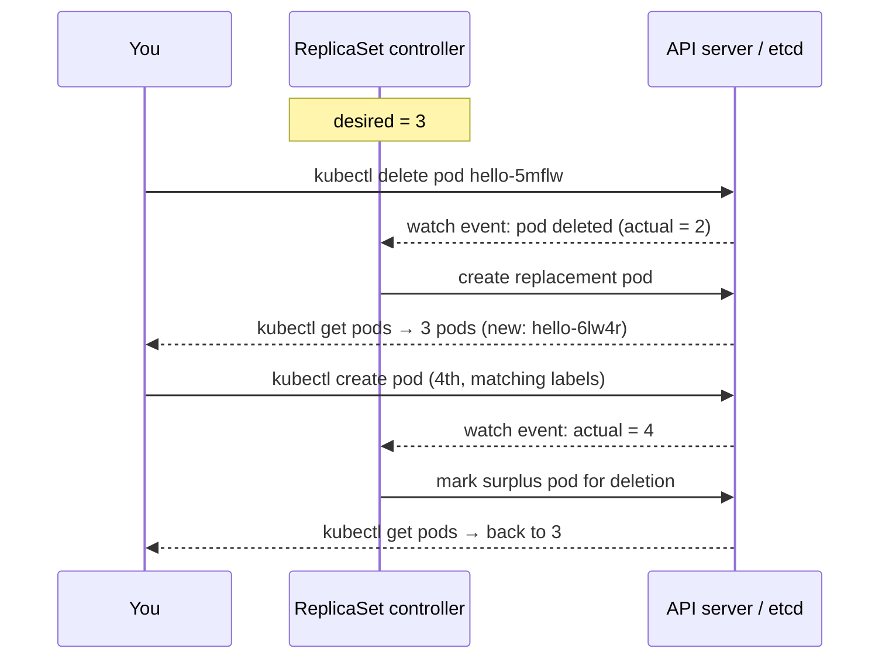

**Both directions matter.** Interviewers love the second half: create an *extra* Pod whose labels match the selector and the ReplicaSet will **delete** it, because reconciliation is symmetric.

```bash
kubectl create deployment hello-kubernetes --image=myrepo/hello:v1
kubectl get deploy                        # deployment exists
kubectl get pods                          # 1 pod by default
kubectl get rs                            # a ReplicaSet was created FOR you
kubectl describe pod <name>               # "Controlled By: ReplicaSet/..."
kubectl scale deployment hello-kubernetes --replicas=3
kubectl get pods                          # now 3
kubectl delete pod hello-kubernetes-5mflw # RS immediately recreates one
```

---

## 3.2 Autoscaling

> **Kubernetes autoscaling** optimises resource usage and cost by scaling automatically in line with demand — at **two layers**: the **cluster/node level** and the **Pod level**.

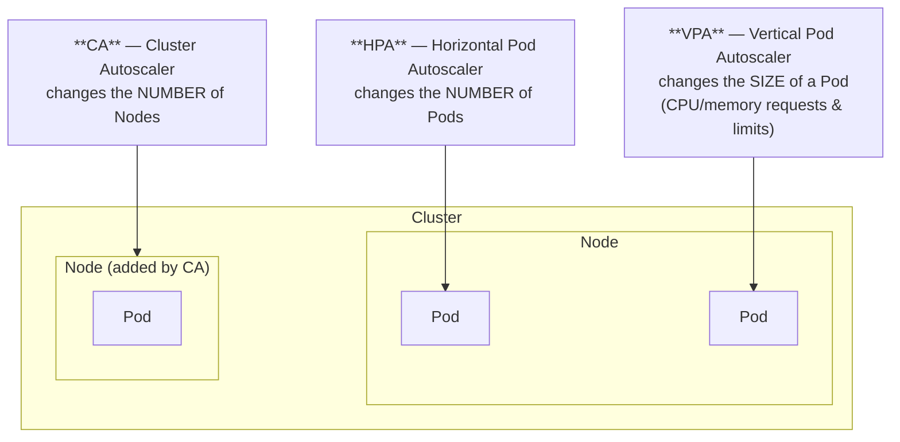

| Autoscaler | Scales | Trigger | Course description |
|---|---|---|---|
| **HPA** (Horizontal Pod Autoscaler) | **Number of replicas** — scaling *out* | Target metrics (CPU/memory utilisation) between a min and max replica count | "Automatically updates a workload resource by horizontally scaling it to match demand" |
| **VPA** (Vertical Pod Autoscaler) | **Resource requests and limits of a container** — scaling *up* | Same kinds of targets; reconciles Pod size against current usage | "Adjusts the resource size or speed of the Pods" — for services where horizontal scaling is impossible or not ideal |
| **CA** (Cluster Autoscaler) | **Number of nodes** | **Pods fail to schedule**, or demand rises/falls relative to node capacity | "Ensures there is always enough compute power to run your tasks, and that you aren't paying extra for unused nodes" |

> ⚠️ **The rule that gets asked:** *do **not** use VPA together with HPA on **resource metrics** like CPU or memory* — they fight each other. You **can** combine them on **custom or external metrics**.

> **Best practice: scale horizontally.** Reach for VPA only where horizontal scaling isn't possible or sensible. **A combination of all three often produces the most optimised solution**: stable at peak, cheap at trough.

### Creating an HPA

```bash
# Preferred: the autoscale command
kubectl autoscale deployment hello-kubernetes --min=2 --max=10 --cpu-percent=50
kubectl get hpa
kubectl get rs        # replicas jumped to 2 — the new minimum
```

- `--min` — minimum Pods
- `--max` — maximum Pods
- `--cpu-percent` — **the trigger**: create a new Pod when CPU usage reaches this % across the cluster

Behind the scenes the Deployment still uses its **ReplicaSet** to scale up and down.

You *can* write the HPA as YAML (`targetCPUUtilizationPercentage` is the YAML name of `--cpu-percent`), but the course's explicit advice is: **even though you can create an HPA from scratch, you should use the `autoscale` command instead.**

```yaml
apiVersion: autoscaling/v1
kind: HorizontalPodAutoscaler
metadata:
  name: hello-kubernetes
spec:
  scaleTargetRef:
    apiVersion: apps/v1
    kind: Deployment
    name: hello-kubernetes
  minReplicas: 2
  maxReplicas: 10
  targetCPUUtilizationPercentage: 50
```

**The day-in-the-life story the course uses** (worth repeating in an interview because it makes the difference concrete):

| Time | HPA | VPA | CA |
|---|---|---|---|
| 7 AM, low load | 1 Pod | Pod with small CPU/mem | Existing nodes suffice |
| 11 AM, peak | scales to 3 Pods | adds CPU/memory to the Pod | adds a **new node** + Pod |
| Afternoon, dropping | 3rd Pod deleted | Pod resized down | unused Pods removed |
| 5 PM, low | 2nd Pod deleted | back to 7 AM size | Pods removed, then the **node itself** removed |

**Where CA pays for itself:** nights and weekends with only dev/CI load; clusters idle between batch runs.

---

## 3.3 Deployment strategies (the reading — high-value interview material)

> A **deployment strategy** defines an application's lifecycle so it reaches and maintains the configured state automatically. Effective strategies **minimise risk**. They're used to deploy/update/rollback ReplicaSets, Pods, Services and applications; pause/resume deployments; and scale manually or automatically.

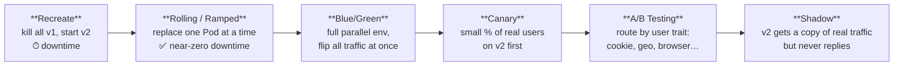

| Strategy | How it works | Pros | Cons |
|---|---|---|---|
| **Recreate** | All v1 Pods shut down **simultaneously**, then v2 Pods created. Rollback = same in reverse | Simplest setup; version completely replaced | **Short downtime** between shutdown and new deployment |
| **Rolling (ramped)** | Each Pod updated **one at a time**: delete a v1, create a v2, repeat. Users are directed to either version during the roll | Simple; **suitable for stateful apps needing data rebalancing**; hardly any downtime | Rollout/rollback **takes time**; **you cannot control traffic distribution** |
| **Blue/Green** | Blue = live. Green = an **exact copy** running the new version, tested thoroughly, then **all traffic switched** | **Instant rollout/rollback, no downtime**; new version available to everyone at once | **Expensive — double resources**; requires rigorous pre-release testing; **stateful apps are difficult** |
| **Canary** | New version tested against a **small set of random real users** alongside live, then rolled out fully | Great for reliability/error/performance monitoring on **real traffic**; **fast rollback** | **Slow rollout**, gradual user access |
| **A/B testing** (split testing) | Two versions with different features; users selected by **weight, cookie value, query parameter, geolocation, browser version, screen size, OS, language** | Multiple versions in parallel; **full control over traffic distribution** | Needs an **intelligent load balancer**; **distributed tracing becomes mandatory** to debug a session |
| **Shadow** | Shadow version deployed alongside live; **both receive every request**, but the shadow **does not return responses to users** | **Performance testing with production traffic**; no user impact; no downtime | **Expensive (double resources)**; complex setup; **not a true user test** → results can be misread; must monitor two environments |

### The comparison matrix (reproduced from the reading)

| Strategy | Zero downtime | Real traffic testing | Targeted users | Cloud cost | Rollback duration | Negative user impact | Setup complexity |
|---|---|---|---|---|---|---|---|
| **Recreate** | ✗ | ✗ | ✗ | low | slow | high | very low |
| **Ramped (rolling)** | ✓ | ✗ | ✗ | low | slow | low | low |
| **Blue/Green** | ✓ | ✗ | ✗ | **high** | **instant** | medium | medium |
| **Canary** | ✓ | ✓ | ✗ | low | fast | low | medium |
| **A/B testing** | ✓ | ✓ | **✓** | low | fast | low | **high** |
| **Shadow** | ✓ | ✓ | ✗ | **high** | **instant** | **none** | **high** |

### How to choose (the reading's own guidance)

- **Recreate** — the app isn't critical and users aren't impacted by short downtime
- **Rolling** — you want gradual deployment, no downtime, easy rollback (the sane default)
- **Blue/Green** — the release is **complex or critical**, needs proper monitoring, and zero downtime
- **Canary** — you want zero downtime and are comfortable exposing the new version to **the public** in small doses
- **A/B testing** — the change is **minor tweaks or UI features** and you want to measure engagement
- **Shadow** — you want production-traffic performance data with **zero user risk**
- **Canary and Shadow use live user requests**, not a sample environment
- You can **combine** strategies

---

## 3.4 Rolling updates and rollbacks

> **Rolling updates** roll out **automated and controlled** app changes across Pods. They work with **Pod templates** (i.e. Deployments) and **allow rollback**.

### Prerequisites before you can safely roll

1. **Add liveness and readiness probes** to the deployment so Pods are correctly marked ready
2. **Add a rolling update strategy** to the YAML

```yaml
apiVersion: apps/v1
kind: Deployment
metadata:
  name: hello-kubernetes
spec:
  replicas: 10
  minReadySeconds: 5          # wait before moving to the next Pod
  strategy:
    type: RollingUpdate
    rollingUpdate:
      maxUnavailable: 5       # at least 50% always available
      maxSurge: 2             # at most 2 extra Pods above the 10
  selector:
    matchLabels: { app: hello }
  template:
    metadata:
      labels: { app: hello }
    spec:
      containers:
        - name: hello
          image: myrepo/hello:v1
          readinessProbe:
            httpGet: { path: /ready, port: 8080 }
            initialDelaySeconds: 5
          livenessProbe:
            httpGet: { path: /health, port: 8080 }
            periodSeconds: 10
```

| Knob | Meaning | The value that matters |
|---|---|---|
| **`maxUnavailable`** | How many Pods may be down during the roll | **Set to 0 for a zero-downtime system** |
| **`maxSurge`** | How many Pods may exist **above** the declared replica count | **`100%` doubles the Pods** — a complete replica is created before the original set is taken down |
| **`minReadySeconds`** | Wait this long after a Pod is Ready before continuing | Useful to let a Pod actually warm up |

### The full update → verify → rollback flow

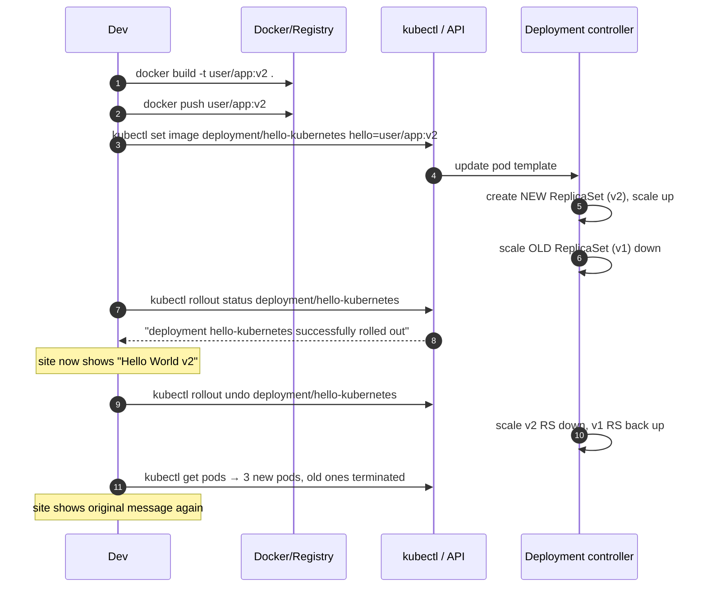

```bash
# Build + push are plain Docker — nothing to do with Kubernetes
docker build -t myuser/hello:v2 .
docker push myuser/hello:v2

# Update the running deployment
kubectl set image deployment/hello-kubernetes hello=myuser/hello:v2
kubectl rollout status deployment/hello-kubernetes
kubectl rollout history deployment/hello-kubernetes

# Roll back
kubectl rollout undo deployment/hello-kubernetes
kubectl get pods                 # old rollout pods terminating, new pods created
kubectl get rs                   # shows old RS scaled back up
kubectl rollout restart deployment/hello-kubernetes   # restart containers in place
```

### All-at-once vs one-at-a-time

| | **All-at-once** | **One-at-a-time (staggered)** |
|---|---|---|
| Rollout | All v1 Pods must be **removed before** v2 Pods become active | A v2 Pod is created, one v1 Pod removed, that v2 becomes active — repeat |
| User access | **Blocked** during the gap; there's a visible time lag | **Never interrupted** |
| Rollback | Same in reverse: all v2 removed before v1 activates → access blocked | Same in reverse, staggered → no interruption |

**This maps directly onto the strategies above:** all-at-once ≈ Recreate; one-at-a-time ≈ Rolling.

---

## 3.5 ConfigMaps and Secrets

> **Good practice: never hard-code configuration variables in application code.** Keep them separate so a config change doesn't require a code change.

### ConfigMap

> An **API object that stores non-confidential data in key-value pairs**. It **provides configuration data to Pods and Deployments** so it isn't hard-coded in the application.

Properties to remember:

- **Meant for non-sensitive information — it provides no secrecy or encryption**
- **Data cannot exceed 1 MB.** For more, mount a volume or use a separate database / file service
- Has optional **`data`** and **`binaryData`** fields — **there is no `spec` field**
- The name must be a **valid DNS subdomain name**
- **Reusable across multiple Deployments** → decouples environment from deployment
- Kubernetes applies the ConfigMap to the Pod/Deployment **just before running it**

**Three ways to create one:**

```bash
# 1. String literals
kubectl create configmap myconfig --from-literal=message="Hello from the config map"

# 2. From a properties / key=value file (or a whole directory, or key=file)
kubectl create configmap myconfig --from-file=my.properties
kubectl create configmap myconfig --from-file=./config-dir/           # entire directory
kubectl create configmap myconfig --from-file=message=my.properties   # custom key

# 3. From a YAML descriptor
kubectl get configmap myconfig -o yaml > my-config.yaml
kubectl apply -f my-config.yaml
kubectl describe configmap myconfig
```

**Two ways a Pod consumes one:** environment variables (via `configMapKeyRef`) or **mounting a file** using the volumes plugin.

```yaml
# Consuming a ConfigMap as an environment variable
spec:
  containers:
    - name: app
      image: myrepo/app:v1
      env:
        - name: message                 # used in code as process.env.message
          valueFrom:
            configMapKeyRef:
              name: myconfig            # the ConfigMap
              key: message              # the key inside it
```

### Secret

Working with a Secret is *like* working with a ConfigMap, with a different purpose: **sensitive information** — passwords, OAuth tokens, SSH keys.

```bash
kubectl create secret generic api-creds --from-literal=API_CREDS="s3cr3t"
kubectl get secrets                       # verify it exists
kubectl describe secret api-creds         # NOTE: the value is NOT shown in plain text
kubectl get secret api-creds -o yaml      # value appears base64-ENCODED
```

> ⚠️ **The honest caveat interviewers want to hear:** `-o yaml` shows the value **encoded**, not **encrypted**. Base64 is not security. That is exactly why anti-pattern #9 recommends a consistent secret strategy such as **HashiCorp Vault**, and why enabling **encryption at rest** for etcd + RBAC matters.

**Three ways to create a Secret (per the course):** a **string literal**, **environment variables**, or **volume mounts**.

**Two ways to consume one:**

```yaml
# A. As an environment variable  → code reads process.env.API_CREDS
env:
  - name: API_CREDS
    valueFrom:
      secretKeyRef:
        name: api-creds
        key: API_CREDS

# B. As a mounted volume → the app reads and parses the file
volumes:
  - name: creds-vol
    secret:
      secretName: api-creds
containers:
  - name: app
    image: myrepo/app:v1
    volumeMounts:
      - name: creds-vol
        mountPath: /etc/API        # secret mounted as a file at /etc/API
```

Note: **each container has its own volumeMount, but they share the volume.**

---

## 3.6 Service binding

> **Service binding** is the process needed to **consume external / backing services** — REST APIs, databases, event buses — from your application. It **manages configuration and credentials for backend services while protecting sensitive data**, and **makes service credentials available automatically as a Secret**.

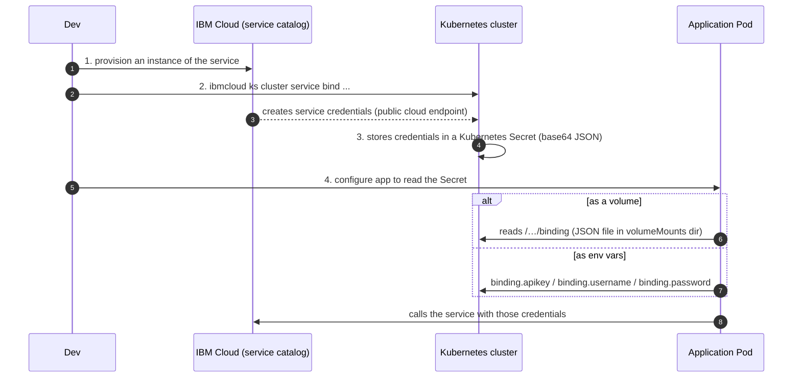

**The four steps, verbatim:**
1. **Provision an instance** of the service (CLI or the IBM Cloud catalog website)
2. **Bind the service to your cluster** to create service credentials using the **public cloud service endpoint**
3. **Store the credentials in a Kubernetes Secret** (done automatically by IBM Cloud service binding; credentials are **base64-encoded JSON**)
4. **Configure your app** to access those credentials from the Secret

**Verifying and consuming:**
```bash
kubectl get secrets           # all secrets in the cluster
# …also visible in the Kubernetes dashboard UI and the IBM Cloud Kubernetes Service UI
```

Two consumption options (same pattern as Secrets generally):
- **Mount the Secret as a volume** to your Pod → creates a **JSON-formatted file named `binding`** in the volumeMounts directory, containing everything needed to reach the service
- **Reference the Secret in environment variables** → `binding.apikey`, `binding.username`, `binding.password`

The course's worked example is the **Watson Tone Analyzer** (linguistic analysis to detect tone in text), consumed from an Express.js app deployed to IBM Cloud Kubernetes Service.

---

## 3.6b Case study — retail (from the module reading)

A compact, quotable example of *why* any of this matters commercially. Useful for the "tell me about a real-world use case" question.

| Retail IT challenge | What goes wrong | Kubernetes/container answer |
|---|---|---|
| **Scalability** | Traffic surges during sales events and holidays; traditional systems don't scale efficiently → performance issues and downtime | Auto-scaling (HPA + CA) absorbs peaks; scales back down off-peak |
| **Deployment bottlenecks** | New offers and features are slow to ship; must not disrupt service | CI/CD (Jenkins, GitLab CI, CircleCI) + **blue-green deployments** → deploy several times a day, feature time dropping from **weeks to minutes** |
| **Resource utilisation** | Over-provisioning wastes money; under-provisioning wastes performance | Dynamic allocation based on real-time demand; **Prometheus / Grafana** monitoring for insight |
| **Disaster recovery** | DR plans exist on paper but aren't robust → big losses during failures | **Multi-region clusters** + automated backups (e.g. **Velero**) for cluster state and persistent volumes → near-zero downtime |

**The enabling move underneath all four:** break the monolith into **microservices**, containerise each with Docker for environment consistency, then let Kubernetes orchestrate deployment, scaling and operation.

> Related: the course also spotlights **IBM Turbonomic**, an AI-driven application resource-management platform that automatically right-sizes Kubernetes workloads — the commercial answer to the "right-sizing containers is hard" challenge named back in Module 1.

---

## 3.7 ⭐ Module 3 — Interview angle

**Q: HPA vs VPA vs CA in one sentence each.**
HPA changes **how many** Pods; VPA changes **how big** each Pod is; CA changes **how many nodes** the cluster has. HPA and CA are complementary — HPA creates Pods that can't schedule, CA notices and adds a node.

**Q: Can I run HPA and VPA together?**
Not on the **same resource metric** (CPU/memory) — they'd fight, because VPA changes the denominator HPA is measuring against. You can combine them on **custom or external metrics**.

**Q: Default: scale up or scale out?**
Scale **out** (horizontal). It's the course's stated best practice, and it gives you redundancy for free. Vertical scaling is for the workloads that genuinely can't be replicated — a single-writer component, a legacy service that isn't concurrency-safe.

**Q: How does a rolling update actually work under the hood?**
The Deployment creates a **second ReplicaSet** for the new Pod template, then shifts replicas: scale the new RS up, the old RS down, respecting `maxSurge` and `maxUnavailable`, waiting `minReadySeconds` and honouring **readiness probes** between steps. The old ReplicaSet is kept (scaled to 0) — that's what makes `kubectl rollout undo` instant.

**Q: How do you guarantee zero downtime during a rollout?**
`maxUnavailable: 0` (plus enough `maxSurge` to make progress), correct **readiness probes** so traffic only reaches Pods that can serve, `minReadySeconds` for warm-up, and a graceful shutdown handler (`preStop` + SIGTERM handling) so in-flight requests finish.

**Q: `maxSurge: 100%` — what does that give me?**
It doubles the Pod count during the roll: a complete replica set of the new version comes up **before** the original is taken down. Effectively a blue/green inside a Deployment — fastest and safest, most expensive in resources.

**Q: Rolling vs Blue/Green vs Canary — pick one and defend it.**
Rolling is the default: cheap, no downtime, built into the Deployment object. Blue/Green when rollback must be **instant** and the release is critical — you pay double resources for that. Canary when you want to validate against **real production traffic** with a small blast radius before committing; you pay in rollout time and need traffic-splitting (which is exactly what Istio adds in Module 4).

**Q: ConfigMap vs Secret?**
Same shape, different intent. ConfigMap = **non-confidential** key-value config, explicitly **no secrecy or encryption**, **1 MB limit**. Secret = sensitive data, base64-encoded at rest in etcd, hidden from `describe`. Both can be consumed as env vars or mounted files. Neither is a substitute for a real secrets manager if the threat model is serious.

**Q: Why not just put config in the image?**
Anti-pattern #1: an image with environment-specific artifacts must be rebuilt per environment, which means the image you tested is not the image you ship. Keep images generic, inject config at runtime — that's the whole point of ConfigMaps.

**Q: My config is 4 MB of reference data. ConfigMap?**
No — ConfigMap data **cannot exceed 1 MB**. Mount a volume, or use a separate database or file service.

**Q: What is service binding and why not just paste credentials into a YAML?**
Service binding provisions the credentials for a backing service and **lands them in a Kubernetes Secret automatically**, so credentials are never in source control, are rotatable independently of the app, and are consumed uniformly (env var or mounted `binding` JSON file). Pasting them into YAML puts secrets in Git.

**Q: A Deployment update is stuck at 2/5 updated. Where do you look?**
`kubectl rollout status` and `kubectl describe deployment` first. Usually one of: new Pods failing readiness probes (so the rollout won't proceed), image pull failure (`ImagePullBackOff` — wrong tag or registry credentials), insufficient cluster resources for the surge Pods, or a crash loop in the new version. `kubectl rollout undo` is the safe immediate action.

---

## 3.8 ⭐ Module 3 — When to use X vs Y

| Decision | Choose the first when… | Choose the second when… |
|---|---|---|
| **HPA vs VPA** | Almost always — stateless, replicable workloads | The workload can't be horizontally scaled (single-writer, licence-bound, legacy) |
| **HPA vs CA** | You're out of Pods | You're out of **nodes** — Pods stuck `Pending` on capacity |
| **`kubectl scale` vs HPA** | A deliberate, known, manual change | Demand is variable and you want it handled without a human |
| **Recreate vs Rolling** | Non-critical app; short downtime acceptable; incompatible versions can't coexist (e.g. breaking DB schema) | Everything else |
| **Rolling vs Blue/Green** | Cost matters, rollback speed of ~minutes is fine | Rollback must be **instant**, release is critical, and you can afford double infrastructure |
| **Blue/Green vs Canary** | You want the new version live for everyone at once after testing | You want **real user traffic** validating gradually, with fast rollback |
| **Canary vs A/B testing** | You're validating **stability/performance** of the same feature | You're comparing **different features** and measuring **engagement**, targeting users by trait |
| **Canary vs Shadow** | You accept a small number of real users seeing v2 | You want **zero** user exposure and only care about performance under real load |
| **ConfigMap vs Secret** | Non-sensitive settings: log level, feature flags, URLs, tuning | Passwords, tokens, keys, certificates |
| **ConfigMap vs mounted volume/DB** | Config under 1 MB | Larger data — a volume, database, or file service |
| **Env var vs volume mount for config** | Simple scalar values; app reads `process.env.X` | Whole config files, certificates, or values that must be **updated without restarting** the Pod |
| **Secret vs Vault** | Course scope; small teams; encryption-at-rest enabled on etcd | Real secret rotation, dynamic credentials, audit — the anti-patterns reading names Vault explicitly |
| **Service binding vs manual Secret** | You're on a cloud whose services support binding | Self-hosted or third-party services — create the Secret yourself, from CI, never from Git |

---

# Module 4 — The Kubernetes Ecosystem: OpenShift, Istio

## 4.1 Red Hat OpenShift

> **OpenShift** is an **enterprise-ready Kubernetes container platform built for the hybrid cloud**, developed and supported by **Red Hat**. It is built on the foundation of **Linux, containers and automation**, provides **full-stack automated operations** and **self-service provisioning** for developers, and adds tooling around the **complete application lifecycle** — build, CI/CD, monitoring, logs — not just orchestration.

**Kubernetes is a critical component of OpenShift.** OpenShift is Kubernetes **plus** an opinionated enterprise platform around it.

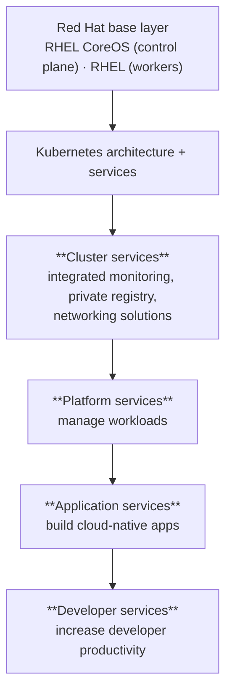

**Layer story to remember:** *Docker* provides abstraction for packaging Linux-based lightweight container images → *Kubernetes* provides cluster management and orchestrates containers across hosts → *OpenShift* adds source-code/build/deployment management, image management at scale, application management at scale, team/user tracking for large developer organisations, and supporting networking infrastructure.

### Features

Scale to **thousands of instances across hundreds of nodes in seconds** · flexible hybrid infrastructure · **open standards** (Kubernetes + **OCI** containers → portable) · comprehensive developer tooling, multi-language support, CLI + IDE integrations · **over-the-air platform upgrades** and one-click Operator Hub services · streamlined/automated builds, deployments, scaling and health management · smaller-footprint **edge** topologies · **policy enforcement across multiple clusters at scale** · access controls, networking, enterprise registry, **built-in scanner, enhanced threat detection, lifecycle vulnerability management, risk profiling** · **enterprise persistent storage** for stateful and stateless apps · a partner ecosystem for storage, network, IDE and CI integrations.

### OpenShift vs Kubernetes — the comparison table (memorise for interviews)

| Aspect | **OpenShift** | **Kubernetes** |
|---|---|---|
| **Nature** | A **product** | An **open-source project** |
| **Installation** | Limited options once installation starts | Installable on **every Linux environment** |
| **Flexibility** | Less flexible | More flexible |
| **Availability** | Online with Azure, and Dedicated | EKS (AWS), GKE (GCP), AKS (Azure) |
| **Image management** | **ImageStreams** → better management | Container image management is not that easy |
| **Security** | **Very strict security policy** | Security maintenance is easy (i.e. permissive by default) |
| **External access** | **Route** objects | **Ingress** objects |
| **Deployments** | `DeploymentConfig` — less flexible | `Deployment` objects — more flexible |
| **User experience** | Good UX out of the box | Requires extra tools for better UX |
| **Networking** | Good networking solutions **out of the box** | Third-party plugins when solutions are unavailable |
| **Service catalog** | Good service catalog | Less provision for better services in clusters |
| **Web console** | User-friendly, easy for beginners | Console layout is difficult for beginners |
| **CI/CD** | **Integrates with Jenkins** | Can integrate CI/CD, **but not with Jenkins** (per the course) |

### Architecture

OpenShift runs **on top of a Kubernetes cluster**, with object data stored in **etcd**. It has a **microservices-based architecture**: services are **REST APIs** exposing the core objects, and **controllers** read those REST APIs, apply changes to other objects, report status / write back, and **maintain the cluster's desired state**.

In an OpenShift environment the **Kubernetes master runs on Red Hat Enterprise Linux CoreOS**, while **worker nodes support Red Hat Enterprise Linux**.

### The `oc` CLI

> **`oc`** is the OpenShift CLI — the most commonly used tool for end-to-end operations. Runs on Windows, Linux and macOS.

- Lets you work **directly with project source code**, script OpenShift operations, and manage projects during **restricted bandwidth or when the web console is unavailable**
- **A copy of `kubectl` is included with `oc`.** The two binaries offer the **same capabilities**, but **`oc` is extended to natively support OpenShift features**: `DeploymentConfig`, `BuildConfig`, **routes**, **image streams**, **image stream tags** — none of which exist in standard Kubernetes
- `oc` adds an **in-built `login` command** for authentication
- `oc new-app` makes it easy to start applications **from existing source code or pre-built images**

```bash
oc login <cluster-url>            # authentication — not available in kubectl
oc new-app https://github.com/org/repo   # build + deploy straight from source
oc get pods                       # same as kubectl get pods
oc project my-project             # switch project (≈ namespace)
oc version
oc get routes                     # OpenShift-only object
oc get is                         # image streams — OpenShift-only
```

---

## 4.2 Builds, BuildConfigs and ImageStreams

> A **build** is the process of **transforming inputs into a resultant object** — for example, transforming source code into a container image.
> A build requires a **BuildConfig**, which **defines the build strategy and the input sources**. *The BuildConfig is the blueprint; the build is an instance of that blueprint.*

### Build input sources — **in order of precedence**

1. **Inline Dockerfile definitions** ← highest precedence
2. Content extracted from existing images
3. **Git repositories**
4. Binary / local inputs
5. Input secrets
6. External artifacts

> **Multiple inputs can be combined into a single build**, and an **inline Dockerfile takes precedence and overwrites any external Dockerfile.** (Classic quiz question.)

### The three build strategies

| Strategy | How it works | When it's right |
|---|---|---|
| **Source-to-Image (S2I)** | Builds **reproducible container images** by **injecting application source into a builder image**, producing a **ready-to-run image** — **no Dockerfile needed**, source→image in a single step. OpenShift ships a **variety of builder images** | The default for standard language runtimes. Saves time and development effort; developers never touch a Dockerfile |
| **Docker** | Requires a repo containing a **Dockerfile** and the necessary artifacts. OpenShift takes the input, invokes `docker build`, creates an image, and pushes it to the **internal OpenShift registry**. Four ways to implement it: **replace Dockerfile from image**, **use Dockerfile path**, **use Docker environment variables**, **add Docker build arguments** | You need full control over the image, or you already have a working Dockerfile |
| **Custom** | **You define and create your own builder image** — a regular Docker image containing the logic to transform inputs into the expected outputs | Non-image outputs. Docker and S2I both produce **runnable images**; a custom build can create **other objects — JAR files, CI/CD deployments that run unit or integration tests**. ⚠️ **Only available to cluster administrators** because it runs with **high privileges** |

### BuildConfig anatomy

```yaml
apiVersion: build.openshift.io/v1
kind: BuildConfig
metadata:
  name: ruby-sample-build
spec:
  runPolicy: Serial              # Serial (default, sequential) or simultaneously
  triggers:                      # what causes a new build
    - type: GitHub
      github: { secret: "secret101" }
    - type: ImageChange
    - type: ConfigChange
  source:                        # the build's source — determines the primary input
    type: Git
    git: { uri: "https://github.com/openshift/ruby-hello-world" }
  strategy:                      # Source (S2I) | Docker | Custom
    type: Source
    sourceStrategy:
      from:
        kind: ImageStreamTag
        name: ruby-20-centos7:latest
  output:                        # where the built image is pushed
    to: { kind: ImageStreamTag, name: origin-ruby-sample:latest }
  postCommit:                    # optional build hook
    script: "bundle exec rake test"
```

| Field | Meaning |
|---|---|
| `runPolicy` | **How builds from this config run** — `Serial` (default, sequentially) or simultaneously |
| `triggers` | List of things that create a new build |
| `source` | Defines the build's source; **source type determines the primary input** (Git repo, inline Dockerfile, binary payload) |
| `strategy` | Which strategy executes the build — Source / Docker / Custom |
| `output` | The repository the built image is pushed to |
| `postCommit` | An **optional build hook** |

### ImageStreams

> An **ImageStream** is an **abstraction for referencing container images within OpenShift**. It **continuously creates and updates container images but contains no actual image data** — it **points to images** stored in internal/external registries or to other ImageStreams.

- A single ImageStream can have **many tags** (`latest`, `dev`, `test`), each pointing to a certain image in a registry
- **To deploy, refer to the ImageStream tag rather than hardcoding the registry URL and tag.** If the source image location changes you **update the ImageStream definition once** instead of updating every deployment
- ImageStreams provide a **trigger capability** that **automatically invokes builds and deployments when a new version of an image is available**

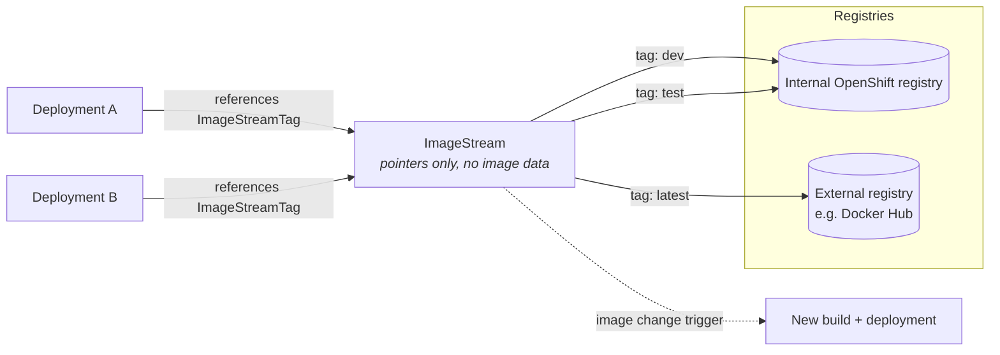

### Build triggers

| Trigger | Fires when | Notes |
|---|---|---|
| **Webhook** | An HTTP **POST** hits an OpenShift API endpoint | Supports **generic** webhooks and the more commonly used **GitHub** webhooks (also GitLab, Bitbucket). Fires on a **new commit, a merged pull request**, tag creation, and more |
| **Image change** | A **new version of an image** becomes available | E.g. your Node.js base image gets a security fix → rebuild automatically. Gives you **automated dependency management** and fast response to vulnerabilities |
| **Configuration change** | A **new BuildConfig resource is created** (or an existing one modified) | Keeps builds in sync with the latest build configuration — source repo changes, strategy changes, output changes |

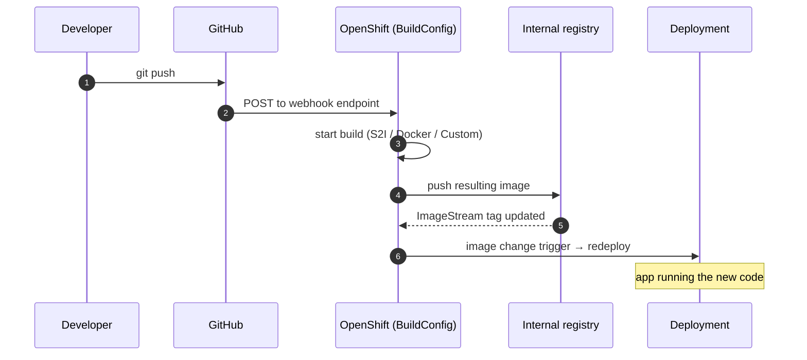

**Why this matters:** cloud-native development requires automation across the container lifecycle. The **OpenShift CI/CD process** automatically merges new code requests to the repository, then **builds, tests, approves and deploys** a new version to different environments.

---

## 4.3 Operators

> **Operators automate cluster tasks and act as a custom controller to extend the Kubernetes API.** They **run in a Pod**, interact with the API server, and **package, deploy and manage Kubernetes applications**, automating creation, configuration and management via **continuous real-time decisions**.

### Human operators vs software operators

**Human operators** understand the system they control — they know how to deploy services and how to recognise and fix problems. **Software operators try to capture that knowledge and automate the same processes.** That's the whole idea in one line.

**What Operators give you:** repeatable install and upgrade · regular **full system health checks** of every component · **over-the-air (OTA) updates** for components and vendor content · a way to **collect and spread knowledge from field engineers to all users** · integration with APIs and CLI tools (`kubectl`, `oc`).

### Service brokers vs Operators

| | **Service broker** | **Operator** |
|---|---|---|
| Process | **Short-running** | **Long-running** |
| Day-2 operations (upgrades, failover, scaling) | ❌ Cannot perform | ✅ Can perform, every day |
| Customisation / parameterisation | **Only at install time** | **Continuously** — the Operator constantly watches cluster state |
| Off-cluster services | ✅ | ✅ |

### The Operator pattern = CRD + custom controller

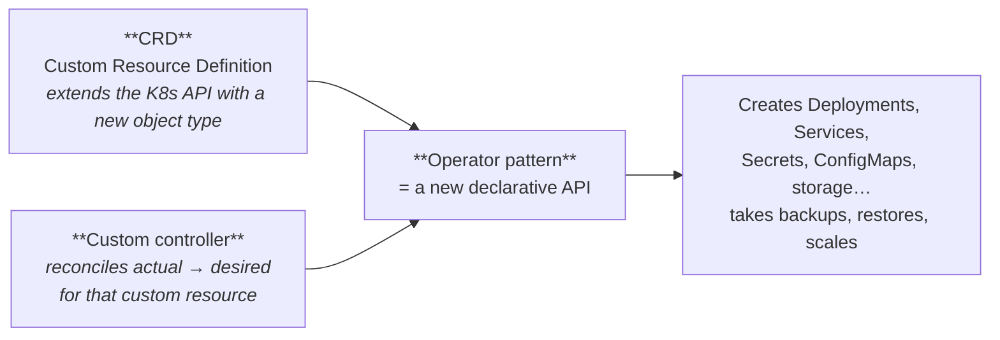

- **CRDs** store and retrieve objects in the Kubernetes API, **extending Kubernetes beyond built-in resources** like Deployments and Pods. They make the API **more modular and flexible**. A CRD is **installed per cluster and available only in that cluster**; once installed, **CRD objects are accessible via `kubectl`** just like Pods
- **Custom controllers** do for custom resources what built-in controllers do for built-in ones: **reconcile actual state with configured state**
- **CRD + custom controller = a declarative API = the Operator pattern.** The controller **interprets CRD data as the desired state** and reconciles the cluster to match

### The Operator Framework

| Component | Role |
|---|---|
| **Operator SDK** (Helm, Go, Ansible) | Helps authors **build, test and package** Operators **without requiring knowledge of Kubernetes API complexities** |
| **Operator Lifecycle Manager (OLM)** | Controls **install, upgrade and RBAC** of Operators in a cluster |
| **Operator Registry** | Stores **CRDs, Cluster Service Versions (CSVs)** and Operator metadata for packages and channels; runs in the cluster to provide catalog data to OLM |
| **OperatorHub** | Web console where cluster administrators **find and one-click-install** Operators |

**The Operator Maturity Model** defines phases of maturity for day-2 operations, ranging from **Basic Install → … → Auto Pilot**, and shows which activities are supported by the **Helm, Go and Ansible** capabilities of the Operator SDK. (Rule of thumb: Helm covers basic install; Ansible adds lifecycle; Go is needed for the deepest automation.)

**OperatorHub catalogue types:** **Red Hat** Operators · **Certified** Operators from ISVs partnered with Red Hat · **Community** Operators from open source, **not officially supported by Red Hat** · **Custom** Operators defined by users. Many Kubernetes-ecosystem tools install this way — **the Istio service mesh is the course's named example.**

**Operator examples:** deploying a whole application (going beyond Deployments to Secrets, ConfigMaps and storage resources) · scaling with multiple replicas based on application type · automating rote tasks like **taking and restoring backups of application state** · integration.

---

## 4.4 Istio and service meshes

> A **service mesh** is a **dedicated layer for making service-to-service communication secure and reliable**. It provides **traffic management** (control the flow between services), **security** (encrypt traffic between services), and **observability** of service behaviour so you can troubleshoot and optimise.

> **Istio** is a **platform-independent** service mesh, often used on Kubernetes.

### The four Istio concepts

| Concept | What it delivers |
|---|---|
| **Connection** | Intelligently control traffic between services — **canary deployments, A/B tests** and other deployment models |
| **Security** | Secures services through **authentication, authorization and encryption** |
| **Enforcement (Control)** | **Enforces policies across an entire fleet**; ensures resources are fairly distributed among consumers |
| **Observability** | Observe traffic flow in the mesh, **trace call flows and dependencies**, view metrics such as **latency and errors** |

**Features:** **TLS-encrypted** communications between services in a cluster with appropriate authn/authz · load balancing for **HTTP, TCP, gRPC and WebSocket** · granular **routing rules** · **retries, fault injection and automatic failover** · policies and API support for **access controls, rate limits and quotas** · automatic monitoring, logging and tracing of **inbound and outbound** traffic · extensible — add cluster applications to the mesh, extend across clusters, or connect **VMs and endpoints outside Kubernetes**.

### Architecture: control plane + data plane

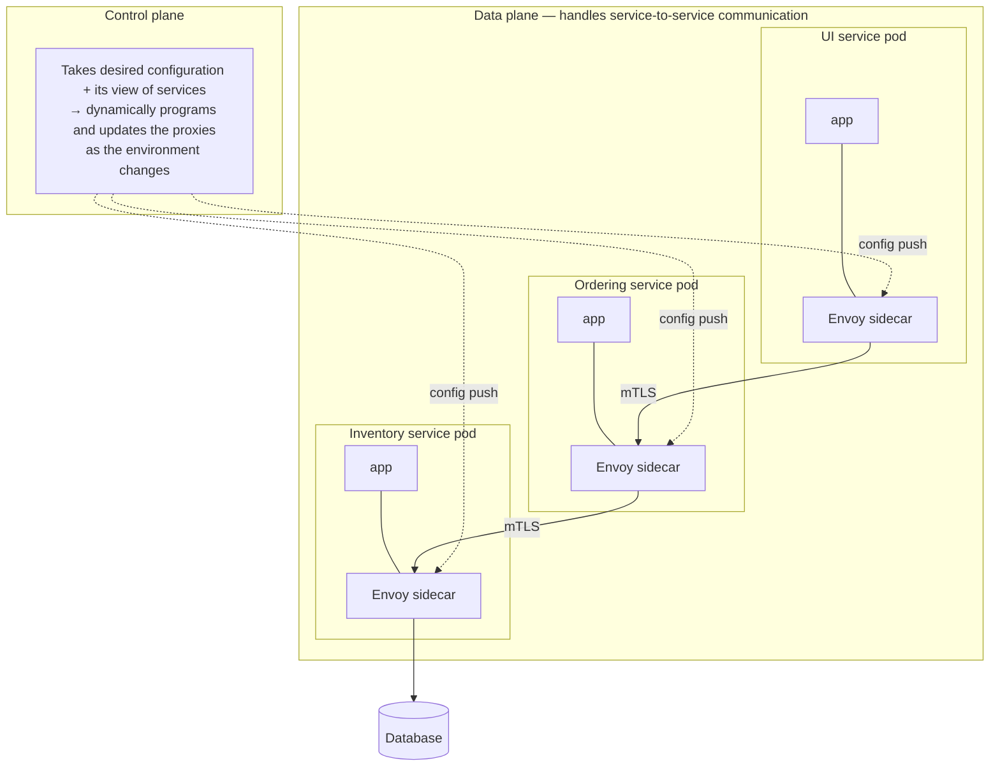

**The key mechanism:** *all network traffic is subject to — intercepted by — a proxy called **Envoy***. Without a mesh, "the network cannot identify the type of traffic that flows, the source, or the destination, and cannot make necessary decisions." The sidecar is what turns opaque traffic into something policy can act on.

### Why microservices need this

Microservices are "a cloud-native architectural approach in which a single application contains many loosely coupled and independently deployable smaller components," communicating over **well-defined APIs**.

| Microservice benefit | Matching microservice challenge | Istio's answer |
|---|---|---|
| Code updates are easy — update only the relevant service | Traffic between services must be **encrypted** | Automatic **mTLS**; defends against **man-in-the-middle** attacks |
| Teams can use **different technology stacks** per component | Teams want to release to a **subset of users** or compare two versions | **Traffic shifting** and **request routing** → canary and A/B testing |
| Components **scale independently** | One slow or unreachable service causes **cascading failures** | **Retries** and **circuit breaking** stop errors propagating |

### Istio in action

**Traffic shifting** — gradually migrate traffic from one version to another: the ordering team sends **5%** to v2, then **50%**, eventually **100%**.

**Request routing** — A/B testing: direct a particular version to a **subset of users** while everyone else gets the original, to confirm the new version increases engagement or performance.

**Security** — encryption between microservices, plus **service access control policies**: in the course's example, the **UI service is unable to talk directly to the inventory service even if it tried**.

### The four golden signals

> Istio provides service-communication metrics covering the **four basic service monitoring needs**: **latency, traffic, errors, saturation.**

Examples given: **request counts** (how much traffic your services receive) and **request duration** in seconds (find bottlenecks, ensure prompt responses).

---

## 4.5 ⭐ Module 4 — Interview angle

**Q: OpenShift vs Kubernetes — what does OpenShift actually add?**
Kubernetes is the orchestration project; OpenShift is a Red Hat **product** that embeds it and adds the rest of the application lifecycle: integrated build system (BuildConfig, S2I), ImageStreams for image management, Routes instead of Ingress, an integrated private registry, a real web console, stricter default security policy, OperatorHub, integrated monitoring/logging, Jenkins CI/CD integration, and over-the-air platform upgrades. Trade-off: less flexible, more opinionated, limited installation options, and it costs money.

**Q: `oc` vs `kubectl`?**
`oc` ships a copy of `kubectl` and has the same capabilities, extended with native support for OpenShift-only objects — DeploymentConfig, BuildConfig, Routes, ImageStreams and ImageStreamTags — plus `oc login` for authentication and `oc new-app` to go from source or a prebuilt image to a running app in one command.

**Q: Route vs Ingress?**
Same purpose — external access to a service. Route is OpenShift's own object and predates Ingress; Ingress is the upstream Kubernetes API object that requires a separately-installed controller. Modern OpenShift accepts Ingress and creates Routes under the covers.

**Q: What is Source-to-Image and why would I use it over a Dockerfile?**
S2I injects application source into a **builder image** and produces a ready-to-run image — source to image in one step, no Dockerfile. You use it for standard runtimes because it's reproducible, developers never maintain build files, and OpenShift ships builder images. You drop to the Docker strategy when you need control the builder image can't give you.

**Q: When is a Custom build strategy appropriate — and what's the catch?**
When the build must produce something other than a runnable image — JAR artifacts, or a CI/CD deployment that runs unit/integration tests. The catch: **custom builds run with high privileges and are only available to cluster administrators.**

**Q: What problem does an ImageStream solve?**
Indirection. Deployments reference an ImageStreamTag instead of a hardcoded `registry/repo:tag`. Move the image, change registries, or promote `dev`→`test`→`latest`, and you edit the ImageStream once rather than every Deployment. It also carries the trigger that fires builds and redeployments when a new image version appears.

**Q: What is an Operator, in terms someone who knows Kubernetes will accept?**
A **CRD plus a custom controller**, running as a Pod in the cluster. The CRD extends the Kubernetes API with a new object type (say, `PostgresCluster`); the controller watches those objects and reconciles the cluster to match — creating Deployments, Services, PVCs, taking backups, doing version upgrades and failover. It encodes what a human operator would do.

**Q: Operator vs Helm chart vs service broker?**
A Helm chart is templating — it renders YAML at install time and then it's done. A service broker is a **short-running** process that also stops after provisioning: no upgrades, failover or scaling. An Operator is a **long-running** control loop that keeps doing **day-2 operations** forever and re-parameterises continuously as cluster state changes.

**Q: What is a service mesh and when do I *not* need one?**
It's an infrastructure layer that moves cross-cutting service-to-service concerns — mTLS, retries, circuit breaking, traffic splitting, telemetry — out of application code into sidecar proxies. You don't need one for a monolith, for a handful of services, or when the added latency, resource cost and operational complexity of running Envoy next to every Pod outweighs what you're getting. Istio earns its keep at scale, with polyglot services, or under a zero-trust/compliance mandate.

**Q: How does Istio actually intercept traffic?**
Every workload gets an **Envoy** sidecar proxy in its Pod. All inbound and outbound traffic goes through Envoy (the **data plane**). The **control plane** takes your desired configuration plus its view of the services and dynamically programs and updates those proxies as the environment changes. Application code is unchanged.

**Q: Istio traffic shifting vs a Kubernetes rolling update — aren't they the same?**
No. A rolling update replaces Pods and gives you **no control over traffic distribution** — the split is whatever the replica ratio happens to be. Istio splits traffic by **percentage or by request attributes**, independently of how many Pods of each version are running. That's what makes real canary and A/B testing possible.

**Q: Which four metrics does Istio give you, and why those four?**
Latency, traffic, errors, saturation — the four golden signals. They're the minimum set that tells you whether a service is healthy from the *user's* point of view rather than the machine's.

---

## 4.6 ⭐ Module 4 — When to use X vs Y

| Decision | Choose the first when… | Choose the second when… |
|---|---|---|
| **OpenShift vs vanilla Kubernetes** | Enterprise, regulated, needs support contract, built-in CI/CD + registry + console + strict security defaults, hybrid/multi-cloud governance | You want maximum flexibility, install anywhere, no licence cost, and you're happy assembling the ecosystem yourself |
| **OpenShift vs managed K8s (EKS/GKE/AKS)** | You need the same platform on-prem **and** in cloud, with one control model | You're single-cloud and want the cheapest, most native option |
| **S2I vs Docker build strategy** | Standard language runtime, you want reproducibility and no Dockerfile maintenance | You need full control of the image, have an existing Dockerfile, or unusual build steps |
| **Docker vs Custom build strategy** | The output is a runnable image | The output is something else (JARs, test runs) — and you're a cluster admin |
| **Webhook vs image-change vs config-change trigger** | React to **source code** changes | Image change: react to **base-image/security updates**. Config change: react to **BuildConfig** changes |
| **ImageStreamTag vs hardcoded image ref** | Always prefer the ImageStream — one place to change | Only when you're outside OpenShift |
| **Operator vs Helm chart** | The application needs **day-2 operations**: upgrades, backups, failover, scaling logic | It's a one-time install with templated values |
| **Operator vs service broker** | You need ongoing lifecycle management | Legacy pattern; the course's own comparison favours Operators |
| **Community vs Certified vs Red Hat Operator** | Prototyping and non-critical workloads | Production — Certified/Red Hat come with support |
| **Istio vs library-level resilience (Hystrix, retries in code)** | Polyglot services, you want policy without touching code, need mTLS everywhere | Small homogeneous stack where a library is cheaper than running a mesh |
| **Istio vs plain Ingress + Deployment** | You need traffic **splitting by percentage or attribute**, mTLS between services, distributed tracing, circuit breaking | Simple north-south routing is all you need |
| **Canary via Istio vs canary via replica counts** | You want a precise, replica-independent traffic percentage | You can live with an approximate split |

---

# Module 5 — Final Project: Guestbook App

## 5.1 What you build

A **simple guestbook application**: a web front end with a text input where you can enter any text and submit it. You create Kubernetes **Deployments and Pods**, then apply **Horizontal Pod Autoscaling**, then perform **Rolling Updates and Rollbacks**. Deployed and managed on **OpenShift**. Two lab tracks: **Option A (Python, default)** and **Option B (JavaScript)** — pick the one matching your Professional Certificate track.

**Estimated time:** ~2 hours. Submission is via **AI-Graded Submission and Evaluation** — you upload URLs, terminal outputs, code snippets or screenshots.

## 5.2 The end-to-end pipeline

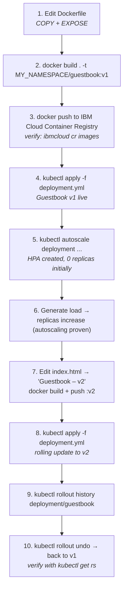

## 5.3 Grading criteria (exactly what you must capture)

| Task | Evidence to save | Points |
|---|---|---|
| 1 | Updated **Dockerfile** showing all details, including `COPY` commands and the `EXPOSE` instruction | 5 |
| 2 | Terminal output showing the image pushed to **IBM Cloud Container Registry with tag `v1`**, via `ibmcloud cr images` | 1 |
| 3 | Code from **`index.html`** showing the default `title` and `h1` tags (Guestbook – v1 index page) | 1 |
| 4 | Terminal output showing the **HPA created with 0 replicas** | 1 |
| 5 | Terminal output showing **increased replicas**, confirming autoscaling works | 2 |
| 6 | Terminal output of the **docker push of the updated image, including the final digest line** | 2 |
| 7 | Terminal output confirming the updated deployment via **`kubectl apply -f deployment.yml`** | 1 |
| 8 | Updated **`index.html`** showing `title` and `h1` as **Guestbook – v2** | 2 |
| 9 | Terminal output showing the **deployment rollout history** with CPU-related changes | 2 |
| 10 | Terminal output from **`kubectl get rs`** showing ReplicaSets **after rollback** | 2 |

> **Practical tip:** the two places people lose points are (a) forgetting `EXPOSE` in the Dockerfile, and (b) capturing `rollout history` *before* the second revision exists. Take the screenshot **after** each `apply`, not at the end.

## 5.4 The commands you'll actually run

```bash
# --- Registry setup (IBM Cloud) ---
ibmcloud version
ibmcloud target                              # which account am I in?
ibmcloud cr region-set <region>              # target the right region
ibmcloud cr login                            # log local docker daemon into ICR
ibmcloud cr namespaces
export MY_NAMESPACE=$(ibmcloud cr namespaces | grep sn-labs- | head -1 | tr -d ' ')

# --- Build & push v1 ---
docker build . -t us.icr.io/$MY_NAMESPACE/guestbook:v1
docker push  us.icr.io/$MY_NAMESPACE/guestbook:v1
ibmcloud cr images                           # ← evidence for Task 2

# --- Deploy ---
kubectl apply -f deployment.yml
kubectl get pods
kubectl get deployments

# --- Autoscale ---
kubectl autoscale deployment guestbook --cpu-percent=5 --min=1 --max=10
kubectl get hpa guestbook                    # ← evidence for Tasks 4 & 5

# --- Update to v2 ---
# edit index.html: title + h1 → "Guestbook - v2"
docker build . -t us.icr.io/$MY_NAMESPACE/guestbook:v2
docker push  us.icr.io/$MY_NAMESPACE/guestbook:v2   # ← keep the digest line
# edit deployment.yml image tag → :v2
kubectl apply -f deployment.yml
kubectl rollout status  deployment/guestbook
kubectl rollout history deployment/guestbook  # ← evidence for Task 9

# --- Rollback ---
kubectl rollout undo deployment/guestbook
kubectl get rs                                # ← evidence for Task 10
```

Also covered in Module 5's practice project: **ConfigMaps, DaemonSets, Kubernetes Services, Secrets and Persistent Volume Claims**, and an optional lab deploying the guestbook **from the OpenShift internal registry**.

---

# Appendix A — Command cheat sheets

## A.1 Docker CLI

| Command | Description |
|---|---|
| `curl localhost` | Pings the application |
| `docker build` | Builds a Docker image from a specified Dockerfile |
| `docker build . -t` | Builds the image and tags the image id |
| `docker container rm` | Removes a container |
| `docker images` | Displays a list of all available Docker images |
| `docker ps` | Lists the containers |
| `docker ps -a` | Lists the containers that ran and exited successfully |
| `docker pull` | Pulls the latest image or repository from a registry |
| `docker push` | Pushes an image or a repository to a registry |
| `docker run` | Runs a command in a new container |
| `docker run -p` | Runs the container by publishing the ports |
| `docker stop` | Stops one or more running containers |
| `docker stop $(docker ps -q)` | Stops **all** currently running containers |
| `docker tag` | Creates a tag for a target image that refers to a source image |
| `docker --version` | Displays the version of the Docker CLI |
| `exit` | Closes the terminal session |
| `export MY_NAMESPACE` | Exports a namespace as an environment variable |
| `git clone` | Clones the git repository containing the artifacts needed |
| `ibmcloud cr images` | Lists images in the IBM Cloud Container Registry |
| `ibmcloud cr login` | Logs your local Docker daemon into IBM Cloud Container Registry |
| `ibmcloud cr namespaces` | Views the namespaces you have access to |
| `ibmcloud cr region-set` | Targets the region appropriate to your cloud account |
| `ibmcloud target` | Information about the account you're targeting |
| `ibmcloud version` | Displays the version of the IBM Cloud CLI |
| `ls` | Lists the files and directories in the current directory |

## A.2 kubectl — architecture & basics

| Command | Description |
|---|---|
| `for …do` | Runs a sequence of commands multiple times as specified |
| `kubectl apply` | Applies a configuration to a resource |
| `kubectl config get-clusters` | Displays clusters defined in the kubeconfig |
| `kubectl config get-contexts` | Displays the current context |
| `kubectl create` | Creates a resource |
| `kubectl delete` | Deletes resources |
| `kubectl describe` | Shows details of a resource or group of resources |
| `kubectl expose` | Exposes a resource to the internet as a Kubernetes service |
| `kubectl get` | Displays resources |
| `kubectl get pods` | Lists all the Pods |
| `kubectl get pods -o wide` | Lists all the Pods with details |
| `kubectl get deployments` | Lists the deployments created |
| `kubectl get services` | Lists the services created |
| `kubectl proxy` | Creates a proxy server between localhost and the Kubernetes API server |
| `kubectl run` | Creates and runs a particular image in a pod |
| `kubectl version` | Prints the client and server version information |

## A.3 kubectl — managing applications

| Command | Description |
|---|---|
| `kubectl autoscale deployment` | Autoscales a Kubernetes Deployment (creates an HPA) |
| `kubectl create configmap` | Creates a ConfigMap resource |
| `kubectl get deployments -o wide` | Lists deployments with details |
| `kubectl get hpa` | Lists Horizontal Pod Autoscalers |
| `kubectl scale deployment` | Scales a deployment |
| `kubectl set image deployment` | Updates the current deployment (triggers a rolling update) |
| `kubectl rollout` | Manages the rollout of a resource |
| `kubectl rollout restart` | Restarts the resource so that the containers restart |
| `kubectl rollout undo` | Rolls back the resource |

## A.4 OpenShift CLI

| Command | Description |
|---|---|
| `oc get` | Displays a resource |
| `oc project` | Switches to a different project |
| `oc version` | Displays version information |
| `oc login` | Authenticates to the cluster (no `kubectl` equivalent) |
| `oc new-app` | Starts an application from existing source code or a prebuilt image |

## A.5 The 20 commands worth having in muscle memory

```bash
# Docker
docker build . -t repo/app:v1
docker run -p 8080:8080 repo/app:v1
docker ps -a
docker images
docker push repo/app:v1
docker stop $(docker ps -q)

# Kubernetes — inspect
kubectl get pods -o wide
kubectl describe pod <name>
kubectl get rs
kubectl get hpa
kubectl get svc

# Kubernetes — change
kubectl apply -f ./k8s/
kubectl scale deployment <name> --replicas=3
kubectl autoscale deployment <name> --min=2 --max=10 --cpu-percent=50
kubectl set image deployment/<name> <container>=repo/app:v2
kubectl rollout status deployment/<name>
kubectl rollout history deployment/<name>
kubectl rollout undo deployment/<name>
kubectl create configmap myconfig --from-literal=k=v
kubectl create secret generic mysecret --from-literal=k=v
```

---

# Appendix B — Master glossary

## B.1 Container basics

| Term | Definition |
|---|---|
| **Agile** | Iterative approach to project management and software development that helps teams deliver value faster and with fewer issues |
| **CI/CD pipeline** | A sequence of automated steps to deliver a new version of software; improves the SDLC through automation |
| **Client-server architecture** | Distributed structure partitioning workloads between providers of a resource (**servers**) and requesters (**clients**) |
| **Cloud native** | An application designed specifically for cloud architecture, run and hosted in the cloud, exploiting cloud delivery characteristics |
| **Container** | A standard unit of software, powered by a containerization engine, encapsulating app code, runtime, system tools, libraries and settings to build, ship and run applications |
| **Container Registry** | System for storage and distribution of named container images; stores images and retrieves them |
| **Daemon-less** | A container runtime that runs **no background daemon** to create objects such as images, containers, networks and volumes (e.g. Podman) |
| **DevOps** | Practices, tools and a cultural philosophy that automate and integrate the processes between software development and IT teams |
| **Docker** | Open container platform for developing, shipping and running applications in containers |
| **Docker client** | The primary interface to Docker; sends commands (e.g. `docker run`) to `dockerd` via the Docker API; **can talk to more than one daemon** |
| **Docker CLI** | The command-line interface the client provides for build/run/stop commands |
| **Docker daemon (`dockerd`)** | Creates and manages Docker objects: images, containers, networks, volumes |
| **Docker Hub** | Cloud-based registry service to create, manage and deliver containerized applications |
| **Docker localhost** | With the host network, `localhost` inside a container resolves to the **physical host**, not the container |
| **Docker remote host** | A machine inside or outside the local network running Docker Engine with ports exposed for the Engine API |
| **Docker networks** | Isolate container communications; containers only talk if on the same network |
| **Docker plugins** | Extensions adding functionality — e.g. storage plugins connecting external storage platforms |
| **Docker storage** | Volumes and bind mounts, used to persist data beyond a container's life |
| **Dockerfile** | Text document containing all commands you'd otherwise run manually to build an image; Docker builds images automatically from it |
| **IBM Cloud Container Registry** | Fully managed **private** registry that stores and distributes container images |
| **Image** | Immutable file containing source code, libraries and dependencies needed to run an application; a template/blueprint for a container |
| **Immutability** | Images are read-only — changing one produces a **new** image |
| **LXC** | LinuX Containers: OS-level virtualization allowing multiple isolated Linux virtual environments on one host |
| **Microservices** | Cloud-native architecture where one application contains many loosely coupled, independently deployable smaller services |
| **Namespace (Linux)** | Kernel feature isolating and virtualizing system resources; processes in a namespace only interact with resources in the same namespace. **Core of Docker's isolation model** — namespaces exist per resource type (networking, storage, processes, hostname) |
| **OS Virtualization** | OS-level paradigm where the kernel allows multiple isolated user-space instances (containers, zones, VPSs, partitions, jails) |
| **Private Registry** | Restricts access so only authorized users can view and use images |
| **Registry** | Hosted service containing repositories of images, responding to the Registry API |
| **Repository** | A set of Docker images, shareable by pushing to a registry; images distinguished by tags |
| **REST API** | API conforming to REST architectural constraints, allowing interaction with RESTful web services |
| **Server Virtualization** | Dividing a physical server into multiple isolated virtual servers, each running its own OS |
| **Serverless** | Cloud-native development model letting developers build and run applications without managing servers |
| **Tag** | A label applied to an image in a repository; how images in a repository are distinguished |

## B.2 Kubernetes basics

| Term | Definition |
|---|---|
| **Automated bin packing** | Increases resource utilization and cost savings using a mix of critical and best-effort workloads |
| **Batch execution** | Manages batch and CI workloads; automatically replaces failed containers if configured |
| **Cloud Controller Manager** | Control-plane component embedding cloud-specific control logic; links the cluster to the cloud provider's API and separates cloud-touching components from cluster-only ones |
| **Cluster** | A set of worker machines (nodes) running containerized applications; every cluster has at least one worker node |
| **Container Orchestration** | Automates the container lifecycle of containerized applications |
| **Container Runtime** | The software responsible for running containers (pluggable via CRI) |
| **Control Loop** | A **non-terminating** loop that regulates the state of a system — a thermostat is the canonical example |
| **Control plane** | The orchestration layer exposing the API and interfaces to define, deploy and manage the container lifecycle |
| **Controller** | A control loop watching cluster state and making/requesting changes to move current state toward desired state |
| **Data (Worker) Plane** | The layer providing CPU, memory, network and storage capacity so containers can run and connect |
| **DaemonSet** | Ensures a copy of a Pod runs across a set of nodes — ideal for log collection, monitoring, node-level daemons |
| **Declarative Management** | You express a desired state; Kubernetes actively ensures observed state matches it |
| **Deployment** | Object providing updates for Pods **and** ReplicaSets; runs multiple replicas by creating ReplicaSets; **suitable for stateless applications** |
| **Designed for extensibility** | Adding features to the cluster **without adding or modifying source code** |
| **Docker Swarm** | Automates deployment of containerized apps; designed specifically for Docker Engine and tooling |
| **Ecosystem** | The array of services, support and tools broadly available and compatible with Kubernetes |
| **etcd** | Highly available distributed key-value store containing **all cluster data**; the **source of truth** for cluster state |
| **Eviction** | Terminating and removing one or more Pods from a Node |
| **Imperative commands** | Commands that directly create, update and delete live objects |
| **Imperative Management** | Defining the steps and actions to reach a desired state |
| **Ingress** | API object managing external access to services in a cluster, typically HTTP; a single entry point routing to multiple services |
| **IPv4/IPv6 dual stack** | Assigns both IPv4 and IPv6 addresses to Pods and Services |
| **Job** | A finite or batch task that runs to completion |
| **kubectl** | CLI for communicating with a cluster's control plane using the Kubernetes API |
| **Kubelet** | Primary node agent on each node; takes PodSpecs (via the API server) and ensures the described containers are running and healthy. **Does not manage containers not created by Kubernetes** |
| **Kubernetes** | De-facto open-source platform standard for container orchestration; developed by Google, maintained by the CNCF |
| **Kubernetes API** | RESTful interface serving Kubernetes functionality and storing cluster state |
| **Kubernetes API Server** | Validates and configures data for API objects (pods, services, replication controllers…); services REST operations and is the **frontend to the cluster's shared state**, through which all other components interact |
| **Kubernetes Controller Manager** | Runs all controller processes monitoring cluster state — replication, endpoints, namespace, service-accounts controllers, etc. |
| **kube-proxy** | Network proxy on each node maintaining the network rules that allow communication to Pods |
| **kube-scheduler** | Watches for newly created Pods with no assigned node and selects a node for them |
| **Label Selector** | Filtering mechanism identifying a set of resources based on labels |
| **Labels** | Key-value pairs tagging objects with identifying, meaningful attributes; enable grouping |
| **Load balancing** | Distributing traffic across Pods for better performance and high availability |
| **Marathon** | An Apache Mesos framework for scaling container infrastructure |
| **Namespace** | Abstraction supporting isolation of groups of resources within a **single** cluster; provides a **scope for names** |
| **Node** | Worker machine (virtual or physical) in a cluster; runs user applications; managed by the control plane |
| **Nomad** | HashiCorp cluster manager and scheduler supporting Docker and other apps on all major OSes, on-prem or cloud |
| **Object** | An entity in the Kubernetes system; the API uses these to represent cluster state |
| **Persistence** | An object exists in the system until modified or removed |
| **Pod** | Smallest and simplest Kubernetes object; a process / single instance of an application; usually wraps one container, sometimes several tightly-coupled ones sharing resources |
| **Preemption** | Logic that helps a **pending** Pod find a suitable Node by evicting lower-priority Pods on it |
| **Proxy** | A server acting as an intermediary for a remote service |
| **ReplicaSet** | Maintains a set of replica Pods running at any given time |
| **Self-healing** | Restarts, replaces, reschedules and kills failing or unresponsive containers |
| **Service** | Abstract way to expose an application running on a set of Pods as a network service; stable IP + load balancing |
| **Service Discovery** | Discovering Pods using their IP addresses or a single DNS name |
| **StatefulSet** | Manages deployment and scaling of a set of Pods with guarantees about **ordering and uniqueness**; for stateful apps like databases |
| **Storage / Storage Orchestration** | Persistent and temporary storage for Pods; automatic mounting of local, network or public-cloud storage |
| **Workload** | An application running on Kubernetes |

## B.3 Managing applications

| Term | Definition |
|---|---|
| **Cluster Autoscaler (CA)** | Autoscales the cluster itself — increases/decreases the number of available nodes pods can run on |
| **ConfigMap** | API object storing **non-confidential** data in key-value pairs; consumed as env vars, command-line args, or config files in a volume |
| **Horizontal Pod Autoscaler (HPA)** | Automatically scales the **number of Pod replicas** based on targeted CPU utilization or custom metrics |
| **Vertical Pod Autoscaler (VPA)** | Adjusts the **CPU and memory resources allocated to an existing Pod** — vertical scaling within a cluster |
| **Persistent Volume (PV)** | API object representing a piece of storage in the cluster; a pluggable resource that **persists beyond the lifecycle of any individual Pod** |
| **Persistent Volume Claim (PVC)** | Claims storage resources defined in a PersistentVolume so it can be mounted as a volume in a container |
| **Rolling Updates** | Roll out application changes in an automated and controlled fashion across Pods; work with Pod templates such as Deployments; allow rollback |
| **Secrets** | Store sensitive information — passwords, OAuth tokens, SSH keys |
| **Service binding** | Establishing connections between applications and external/backing services (REST APIs, databases, event buses) |
| **Volume** | A directory containing data, accessible to multiple containers in a Pod |
| **Volume Mount** | Mounting a declared volume into a container in the same Pod |
| **Volume Plugin** | Enables integration of storage within a Pod |

## B.4 OpenShift, Operators and Istio

| Term | Definition |
|---|---|
| **A/B testing** | Evaluates two versions (A and B) with different features for different user sets; the better performer is deployed globally |
| **Build** | The process of transforming inputs into a resultant object |
| **BuildConfig** | OpenShift object defining the process a build follows, using input sources and a build strategy. **The BuildConfig is the blueprint; the build is an instance of it** |
| **Canary Deployment** | Deploys the new version by gradually increasing the number of users; uses **real users** to test, so bugs are found before global rollout |
| **Circuit breaking** | Prevents errors in one microservice from cascading to others |
| **Configuration Change** | Trigger causing a new build when a new BuildConfig resource is created |
| **Control plane (Istio)** | Takes the desired configuration and its view of the services, then dynamically programs and updates the proxy servers as the environment changes |
| **CRDs** | Custom code defining a resource added to the Kubernetes API server without building a complete custom server |
| **Custom build strategy** | Requires you to define and create your own builder image |
| **Custom builder images** | Regular Docker images containing the logic to transform inputs into expected outputs |
| **Custom controllers** | Reconcile a custom resource's actual state with its desired state |
| **Data plane (Istio)** | Handles communication between services; without a mesh the network can't identify traffic type, source or destination, or make decisions |
| **Enforceability (Control)** | Istio enforces policies across an entire fleet and ensures resources are fairly distributed among consumers |
| **Envoy proxy** | The proxy that intercepts all network traffic in the mesh, enabling many features depending on configuration |
| **Human operators** | People who understand the systems they control — how to deploy services and recognise/fix problems |
| **Image Change** | Trigger that rebuilds a containerized application when a new or updated image version is available |
| **ImageStream** | Abstraction for referencing container images within OpenShift; contains **no image data**, only pointers to image digests |
| **ImageStream Tag** | An identity for a pointer in an ImageStream that points to a certain image in a registry |
| **Istio** | Platform-independent service mesh often used with Kubernetes; controls traffic and API calls between services, secures via authn/authz/encryption, enforces fleet-wide policies, and provides observability |
| **Man-in-the-middle attack** | Attacker secretly intercepts and relays messages between two parties who believe they're communicating directly |
| **Observability** | Observe traffic flow in the mesh, trace call flows and dependencies, view metrics such as latency and errors |
| **OpenShift** | A hybrid-cloud, enterprise Kubernetes application platform |
| **OpenShift CI/CD process** | Automatically merges new code changes to the repo, then builds, tests, approves and deploys a new version to different environments |
| **Operators** | Automate cluster tasks and act as a custom controller to extend the Kubernetes API |
| **Operator Framework** | Family of tools and capabilities covering coding, testing, delivery and updating of Operators |
| **OperatorHub** | Web console where cluster admins find Operators to install — Red Hat, Certified (ISV), Community (unsupported), and Custom |
| **Operator Lifecycle Manager (OLM)** | Controls install, upgrade and RBAC of Operators in a cluster |
| **Operator maturity model** | Phases of maturity for day-2 operations, from **Basic Install** to **Auto Pilot** |
| **Operator Pattern** | System design linking a controller to one or more custom resources |
| **Operator Registry** | Stores CRDs, Cluster Service Versions (CSVs) and Operator metadata for packages and channels; feeds the catalog to OLM |
| **Operator SDK** | Toolkit (Helm, Go, Ansible) to build, test and package Operators without deep Kubernetes API knowledge |
| **`postCommit`** | Section of a BuildConfig defining an optional build hook |
| **Retries** | Automatically reattempting a failed request to another service |
| **`runPolicy`** | BuildConfig field controlling how builds run — `Serial` (default, sequential) or simultaneously |
| **Service Broker** | Short-running process that **cannot** perform day-2 operations such as upgrades, failover or scaling |
| **Service Mesh** | Dedicated layer making service-to-service communication secure and reliable: traffic management, security/encryption, observability |
| **Software operators** | Capture the knowledge of human operators and automate the same processes |
| **Source-to-Image (S2I)** | Tool for building reproducible container images by injecting application source into a builder image to produce a ready-to-run image |
| **Source strategy / Source type** | Strategy = how the build executes (Source / Docker / Custom). Source type = the primary input (Git repo, inline Dockerfile, binary payload) |
| **Webhook** | Trigger sending a request to an OpenShift API endpoint — commonly a GitHub webhook on new commit, merged PR, etc. |

---

# Appendix C — Rapid-fire interview bank

> Answers deliberately short — the goal is to sound like someone who's used this, not recited it.

## Containers & Docker

| # | Question | Sharp answer |
|---|---|---|
| 1 | Container vs VM? | VM virtualises hardware and ships a full guest OS (GBs, minutes to boot); container virtualises the OS and shares the host kernel (MBs, instant). Density and speed vs isolation strength |
| 2 | What's inside a container image? | App code, runtime, system tools, system libraries, settings — everything but the kernel |
| 3 | Image vs container? | Image = immutable read-only layered template. Container = running instance + thin writable layer |
| 4 | Why layers? | Rebuild only what changed; share layers across images to save disk and bandwidth |
| 5 | What does `dockerd` do? | Listens for Docker API requests; builds, runs and distributes containers; manages images, containers, namespaces, networks, storage, plugins |
| 6 | Can the Docker client talk to a remote daemon? | Yes — and to more than one; daemons can also talk to each other to manage services |
| 7 | How does Docker isolate containers? | Linux **namespaces** — a set per container, one per resource type (network, storage, process, hostname) — plus cgroups for limits |
| 8 | First instruction in every Dockerfile? | `FROM` — it defines the base image |
| 9 | `RUN` vs `CMD`? | `RUN` executes at **build** time and creates a layer; `CMD` is the **default command at container start**, and only the **last** one counts |
| 10 | `CMD` vs `ENTRYPOINT`? | `CMD` supplies default args that `docker run` can override; `ENTRYPOINT` fixes the executable. Common pattern: `ENTRYPOINT` = binary, `CMD` = default flags |
| 11 | Does `EXPOSE` publish a port? | No — it's declarative. Publish with `docker run -p host:container` |
| 12 | Three parts of an image name? | hostname (registry) / repository : tag — e.g. `docker.io/ubuntu:18.04`; the hostname is optional in the Docker CLI |
| 13 | How do you persist container data? | **Volumes** (Docker-managed) or **bind mounts** (host path). Without them, data dies with the container |
| 14 | Public vs private registry? | Public (Docker Hub) is open to all; private (ICR, self-hosted) restricts to authorized users — the enterprise default |
| 15 | Name four container vendors and their niches | Docker (most popular), Podman (daemon-less, more secure), LXC (data-intensive), Vagrant (highest isolation) |
| 16 | When is containerization a bad idea? | Monoliths with high migration cost, strict high-performance workloads, strict security isolation requirements |
| 17 | How do you shrink an image? | Slim/alpine base, multi-stage builds, chain `RUN` commands, `.dockerignore`, don't install build tools in the runtime layer |
| 18 | What are the container challenges the course names? | Host-OS security, managing thousands of containers, converting monolithic legacy apps, right-sizing containers |

## Kubernetes core

| # | Question | Sharp answer |
|---|---|---|
| 19 | What is Kubernetes in one sentence? | An open-source system for automating deployment, scaling and management of containerized applications, driven by declarative desired state |
| 20 | What is Kubernetes **not**? | Not a PaaS, not opinionated, not a CI/CD pipeline, not a logging/monitoring solution, not a provider of middleware or databases |
| 21 | `spec` vs `status`? | `spec` = desired state, written by you. `status` = current state, written by Kubernetes. Controllers close the gap |
| 22 | Control plane components? | kube-apiserver, etcd, kube-scheduler, kube-controller-manager, cloud-controller-manager |
| 23 | Worker node components? | kubelet, container runtime, kube-proxy — plus the Pods themselves |
| 24 | Why is the API server special? | It's the **only** front door — all cluster communication goes through it; designed to scale horizontally behind a load balancer |
| 25 | What's in etcd and why does it matter? | All cluster data — it **defines** cluster state. Lose it and you lose the cluster; back it up |
| 26 | Who creates Nodes? | **Not Kubernetes** — the cloud provider or your infrastructure does; the control plane only manages them. That's what keeps K8s infrastructure-agnostic |
| 27 | What does the kubelet do? | Receives PodSpecs from the API server, ensures those Pods/containers run as desired via the container runtime, and reports health/status back |
| 28 | Why is the container runtime pluggable? | The **Container Runtime Interface (CRI)** — so Docker, containerd, CRI-O or Podman can be swapped without changing Kubernetes |
| 29 | What's a Namespace for? | Isolating groups of resources within one cluster; provides a scope for object names; useful for shared clusters and many users |
| 30 | Labels vs names? | A name uniquely identifies one object per type per namespace. Labels are non-unique key-value tags — and **label selectors are the core grouping mechanism** |
| 31 | Smallest deployable unit? | The **Pod** — one or more containers sharing node resources and able to communicate among themselves |
| 32 | Why would a Pod have two containers? | Tightly-coupled helpers: sidecars (Envoy proxy, log shipper), adapters, init patterns. One process per container is still the rule |
| 33 | ReplicaSet vs ReplicationController? | ReplicaSet supersedes it — use ReplicaSet (in practice, use a Deployment) |
| 34 | What does a Deployment give you that a ReplicaSet doesn't? | **Rolling updates**, rollout history and rollback |
| 35 | What is a Service and why can't I use Pod IPs? | Pods are ephemeral with changing IPs; a Service gives one stable IP/DNS name, selects Pods by label and load-balances — built-in service discovery |
| 36 | Four Service types? | ClusterIP (default, internal), NodePort (extends ClusterIP, node IP + static port, not for prod), LoadBalancer (extends NodePort, cloud ELB), ExternalName (DNS CNAME, no selector) |
| 37 | Does creating a LoadBalancer create anything else? | Yes — NodePort and ClusterIP Services are created automatically |
| 38 | When would you use ExternalName? | To represent external storage/services, and to let Pods in different namespaces reach each other via a stable name |
| 39 | Ingress vs Ingress controller? | Ingress = the routing rules (API object). Controller = the running component (NGINX etc.) that implements them. **The controller must be explicitly running** |
| 40 | DaemonSet use cases? | Storage, logs, monitoring — anything needing exactly one Pod per node |
| 41 | StatefulSet vs Deployment? | StatefulSet guarantees ordering, uniqueness, sticky Pod identity and persistent volumes — for databases and stateful systems |
| 42 | Job vs CronJob? | Job runs Pods to completion and retries until done; CronJob creates Jobs on a repeating schedule |
| 43 | kubectl command structure? | `kubectl <command> <TYPE> <NAME> <flags>` — order matters |
| 44 | Three kubectl management approaches? | Imperative commands (easy, no audit trail, dev/test), imperative object configuration (templates + Git, but you must specify every operation), declarative object configuration (`apply`, K8s derives the operations — **ideal for production**) |
| 45 | Ten Kubernetes capabilities? | Rollouts/rollbacks, storage orchestration, horizontal scaling, automated bin packing, secret & config management, IPv4/IPv6 dual stack, batch execution, self-healing, service discovery & load balancing, designed for extensibility |

## Scaling, updates, config

| # | Question | Sharp answer |
|---|---|---|
| 46 | HPA vs VPA vs CA? | Number of Pods / size of Pods / number of Nodes |
| 47 | Can HPA and VPA coexist? | Not on the same resource metric (CPU/memory) — only on custom or external metrics |
| 48 | Which layers can Kubernetes autoscale? | Cluster (node) level and Pod level |
| 49 | Command to autoscale? | `kubectl autoscale deployment X --min=2 --max=10 --cpu-percent=50` — and the course prefers this over hand-written HPA YAML |
| 50 | `maxSurge` and `maxUnavailable`? | Surge = extra Pods allowed above replicas; unavailable = Pods allowed to be down. **`maxUnavailable: 0` for zero downtime**; `maxSurge: 100%` doubles Pods before taking the old set down |
| 51 | What must you add before a safe rolling update? | **Liveness and readiness probes** — otherwise Pods are marked ready before they can serve |
| 52 | How does rollback work? | The old ReplicaSet is retained at 0 replicas; `kubectl rollout undo` scales it back up and the new one down |
| 53 | Six deployment strategies? | Recreate, Rolling (ramped), Blue/Green, Canary, A/B testing, Shadow |
| 54 | Which strategies test with real traffic? | **Canary and Shadow** (and A/B, which targets users by trait) |
| 55 | Which strategy has instant rollback? | **Blue/Green** (and Shadow) — at the cost of double resources |
| 56 | ConfigMap limits? | **1 MB**, non-confidential only, no `spec` field, name must be a valid DNS subdomain; larger data → volume, DB or file service |
| 57 | Three ways to create a ConfigMap? | String literals (`--from-literal`), a properties/key=value file or directory (`--from-file`), or a YAML descriptor |
| 58 | Two ways to consume a ConfigMap/Secret? | Environment variables (`configMapKeyRef` / `secretKeyRef`) or a mounted volume |
| 59 | Are Kubernetes Secrets encrypted? | Base64-**encoded** by default, not encrypted. Enable etcd encryption-at-rest, apply RBAC, and for real rotation use something like Vault |
| 60 | What is service binding? | Provisioning an external service's credentials and landing them automatically in a Kubernetes Secret, consumed as env vars or a mounted `binding` JSON file — so credentials never live in code or Git |

## OpenShift, Operators, Istio

| # | Question | Sharp answer |
|---|---|---|
| 61 | What does OpenShift add to Kubernetes? | Builds (BuildConfig, S2I), ImageStreams, Routes, internal registry, web console, strict security defaults, OperatorHub, integrated monitoring/logging, Jenkins CI/CD, OTA platform upgrades — as a supported product |
| 62 | `oc` vs `kubectl`? | `oc` includes `kubectl` and adds native support for DeploymentConfig, BuildConfig, Routes, ImageStreams/Tags, plus `oc login` and `oc new-app` |
| 63 | Route vs Ingress? | Both expose services externally; Route is OpenShift's native object, Ingress is upstream Kubernetes and needs a controller |
| 64 | Three build strategies? | **S2I** (inject source into a builder image, no Dockerfile), **Docker** (needs a Dockerfile, runs `docker build`), **Custom** (your own builder image; can output non-image artifacts; **admin-only, high privilege**) |
| 65 | Build input precedence? | Inline Dockerfile → content from existing images → Git repos → binary/local inputs → input secrets → external artifacts. **Inline Dockerfile overwrites any external one** |
| 66 | What is an ImageStream? | An abstraction pointing at container images (no image data). Deployments reference an ImageStreamTag, so you change the pointer once instead of every Deployment; it also triggers builds/deployments on new image versions |
| 67 | Three build triggers? | **Webhook** (commit/PR from GitHub or generic), **Image change** (new base image version), **Configuration change** (new/updated BuildConfig) |
| 68 | What is an Operator? | A CRD + custom controller running in a Pod that packages, deploys and manages an application, making continuous real-time decisions — encoded human-operator knowledge |
| 69 | Operator vs service broker? | Broker = short-running, install-time only, no day-2 ops. Operator = long-running, does upgrades, failover, scaling, continuously re-parameterises |
| 70 | Operator Framework pieces? | Operator SDK (Helm/Go/Ansible), Operator Lifecycle Manager (install/upgrade/RBAC), Operator Registry (CRDs, CSVs, metadata), OperatorHub (discovery + one-click install) |
| 71 | Operator maturity model range? | **Basic Install → Auto Pilot** |
| 72 | What is a service mesh? | A dedicated layer for secure, reliable service-to-service communication — traffic management, security/encryption, observability |
| 73 | Istio's four concepts? | **Connection, Security, Enforcement (Control), Observability** |
| 74 | Control plane vs data plane in Istio? | Data plane = Envoy sidecars carrying and intercepting all service traffic. Control plane = takes desired config + its view of services and dynamically programs those proxies |
| 75 | Istio's four monitoring metrics? | **Latency, traffic, errors, saturation** |
| 76 | Which protocols does Istio load balance? | HTTP, TCP, gRPC, WebSocket |
| 77 | How does Istio enable canary releases? | Traffic shifting by percentage (5% → 50% → 100%) and request routing by user attributes — independent of replica counts |
| 78 | Microservices problems Istio solves? | Encrypting inter-service traffic, canary/A-B rollouts, and cascading failures — via retries and circuit breaking |

---

## Final revision sheet — one-liners to burn in

- **A container** = code + runtime + libs + settings in one standard unit.
- **Images are immutable; containers are not.** The writable layer is the only difference.
- **Docker = client + host (`dockerd`) + registry.** `build` → `push` → `run`.
- **A Dockerfile must start with `FROM`, and only the last `CMD` wins.**
- **Kubernetes is declarative:** `spec` is yours, `status` is Kubernetes', controllers close the gap forever.
- **etcd is the truth; the API server is the only door.**
- **Nodes are made by the cloud provider, not by Kubernetes.**
- **ReplicaSets acquire Pods by label — they don't own them.**
- **Use a Deployment, not a ReplicaSet, not a bare Pod.**
- **LoadBalancer ⊃ NodePort ⊃ ClusterIP.**
- **Ingress without a controller does nothing.**
- **Declarative (`kubectl apply` from Git) for production. Imperative for exploration.**
- **HPA = more Pods · VPA = bigger Pods · CA = more Nodes. Never HPA+VPA on the same resource metric.**
- **`maxUnavailable: 0` is how you get zero downtime.**
- **`kubectl rollout undo` works because the old ReplicaSet is kept at zero.**
- **ConfigMap ≤ 1 MB, no secrecy. Secrets are base64-encoded, not encrypted.**
- **Never bake config into images; never use `latest` in production; never `kubectl edit` in production.**
- **OpenShift = Kubernetes + builds + ImageStreams + Routes + registry + console + strict security, as a product.**
- **S2I = source → runnable image, no Dockerfile.**
- **Operator = CRD + custom controller = automated day-2 operations.**
- **Service mesh = mTLS + traffic control + observability, in sidecars, without touching app code.**

---

*Notes compiled from all five modules of IBM's "Introduction to Containers w/ Docker, Kubernetes & OpenShift" (Coursera) — every lecture transcript, reading, cheat sheet and glossary.*
